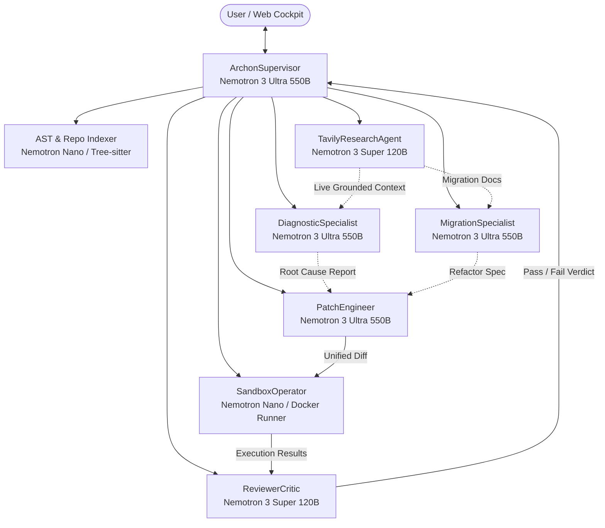
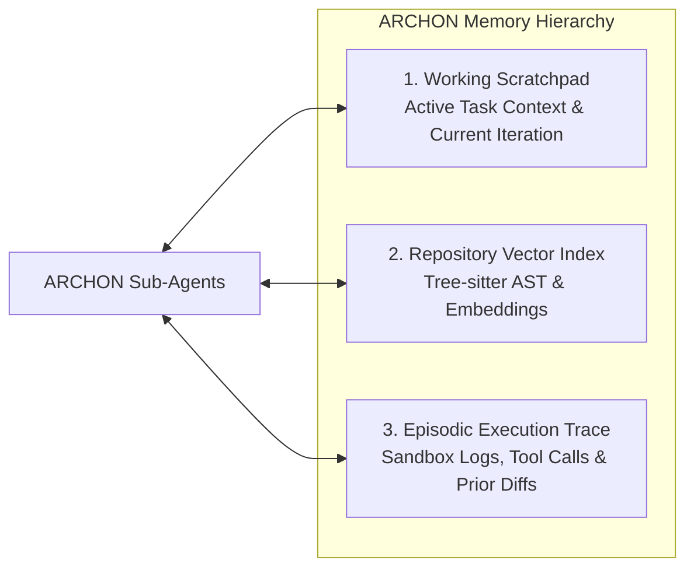

# ARCHON — Agent Architecture, Roles & Protocols (AGENTS.md)

> **Document Version:** 1.0.0  
> **Platform:** ARCHON Autonomous Agentic Engineering Framework  
> **Model Backbone:** NVIDIA Nemotron Family on Nebius Token Factory  
> **Orchestration Pattern:** Hierarchical Supervisor with Specialized Sub-Agents  
> **Communication Protocol:** Typed Asynchronous JSON Event Bus  

---

## 1. Multi-Agent Hierarchy & System Topology

ARCHON operates as a **hierarchical multi-agent network**. Rather than forcing a single model to perform every task, ARCHON delegates responsibilities to dedicated agent personas specialized in static analysis, root-cause investigation, web research, sandbox execution, and code synthesis:



---

## 2. Agent Personas & Specifications

### 2.1 `ArchonSupervisor` (The Mission Commander)
* **Role:** High-level mission planner, state machine governor, and user interaction coordinator.
* **Underlying Model:** `nvidia/nemotron-3-ultra-550b` (on Nebius Token Factory).
* **Key Responsibilities:**
  - Ingests the mission goal from the user (Migration, Bug Healing, or Modernization).
  - Decomposes the mission into an execution plan with discrete milestones.
  - Dispatches sub-agents in topological order.
  - Monitors the convergence loop and manages iteration budgets (max 5 retries).
* **Tool Access:** `dispatch_agent`, `evaluate_mission_status`, `emit_stream_thought`.
* **System Instruction:**
  ```text
  You are ArchonSupervisor, the lead autonomous engineering orchestrator operating on Nebius Token Factory and NVIDIA Nemotron.
  Your goal is to lead the automated resolution of software engineering tasks with 100% test verification.
  Coordinate your specialized sub-agents, monitor sandbox exit codes, ensure all patches are minimal and regression-free, and never deliver unverified code.
  ```

---

### 2.2 `MigrationSpecialist` (The Sovereign AI Stack Migrator)
* **Role:** Scans, identifies, and rewires proprietary AI model dependencies (OpenAI, Anthropic, AWS Bedrock) to native Nebius Token Factory endpoints.
* **Underlying Model:** `nvidia/nemotron-3-ultra-550b`.
* **Key Responsibilities:**
  - Parses AST to detect client instantiations (e.g. `OpenAI()`, `Anthropic()`).
  - Rewires base URLs to `https://api.tokenfactory.nebius.com/v1` and injects `NEBIUS_API_KEY`.
  - Maps proprietary models to optimal NVIDIA Nemotron counterparts:
    * `gpt-4o` / `claude-3-5-sonnet` ➔ `nvidia/nemotron-3-ultra-550b`
    * `gpt-4o-mini` / `claude-3-haiku` ➔ `nvidia/nemotron-3-super-120b`
  - Rewrites JSON function-calling definitions, tool-use calls, and streaming event listeners.
* **Tool Access:** `ast_grep`, `read_source_file`, `query_nebius_catalog`.

---

### 2.3 `DiagnosticSpecialist` (The Root-Cause Investigator)
* **Role:** Analyzes failing CI/CD logs, terminal stack traces, and test errors to deduce the exact underlying architectural flaw.
* **Underlying Model:** `nvidia/nemotron-3-ultra-550b`.
* **Key Responsibilities:**
  - Extracts the exact error signature (exception class, filename, line number, stack trace).
  - Correlates the error against the repository dependency graph.
  - Formulates search queries for `TavilyResearchAgent` to fetch upstream documentation or community bug reports.
  - Generates a structured Root Cause Report (RCR) containing reproduction steps and required code changes.
* **Tool Access:** `read_sandbox_stderr`, `inspect_code_context`, `request_tavily_search`.

---

### 2.4 `TavilyResearchAgent` (The Real-Time Grounder)
* **Role:** Queries the live web to obtain 2026 documentation, library migration matrices, CVE fixes, and upstream GitHub issue resolutions.
* **Underlying Model:** `nvidia/nemotron-3-super-120b`.
* **Key Responsibilities:**
  - Synthesizes technical queries from error signatures and library names.
  - Invokes the Tavily Search API (`search_depth="advanced"`, domain filters for GitHub, StackOverflow, official docs).
  - Cleans and summarizes raw web scrape results into actionable code snippets.
* **Tool Access:** `tavily_search`, `tavily_extract_url`.
* **System Instruction:**
  ```text
  You are TavilyResearchAgent. You ground Archon in real-time technical documentation and verified bug resolutions using Tavily Search.
  Filter out marketing content and return concise, verified code syntax and migration matrices.
  ```

---

### 2.5 `PatchEngineer` (The Code Refactorer & Synthesizer)
* **Role:** Authors clean, surgical, syntactically valid unified diffs to fix bugs or complete migrations.
* **Underlying Model:** `nvidia/nemotron-3-ultra-550b`.
* **Key Responsibilities:**
  - Takes the Root Cause Report or Migration Spec and authors precise file diffs.
  - Preserves coding style, type annotations, and existing comments.
  - Adds regression test cases to the test suite to prevent recurrence.
* **Tool Access:** `create_unified_diff`, `validate_ast_syntax`.
* **Output Format:** Strict JSON array of file patches:
  ```json
  [
    {
      "path": "src/services/ai_client.py",
      "action": "MODIFY",
      "diff": "--- a/src/services/ai_client.py\n+++ b/src/services/ai_client.py\n@@ -12,4 +12,6 @@\n-from openai import OpenAI\n+import os\n+from openai import OpenAI\n-client = OpenAI()\n+client = OpenAI(base_url=\"https://api.tokenfactory.nebius.com/v1\", api_key=os.getenv(\"NEBIUS_API_KEY\"))"
    }
  ]
  ```

---

### 2.6 `SandboxOperator` (The Execution Engine)
* **Role:** Manages the lifecycle of ephemeral container sandboxes, executes shell commands, runs test suites, and streams terminal output.
* **Underlying Model:** `nvidia/nemotron-nano` (or direct deterministic Python runtime).
* **Key Responsibilities:**
  - Clones repository into the isolated container.
  - Applies git diffs generated by `PatchEngineer`.
  - Executes test suites (`pytest`, `npm test`, `cargo test`, etc.).
  - Captures and streams stdout and stderr to the frontend xterm.js terminal.
* **Tool Access:** `exec_in_sandbox`, `apply_git_patch`, `revert_git_patch`, `stream_stdout`.

---

### 2.7 `ReviewerCritic` (The Quality Gatekeeper)
* **Role:** Independent quality and security auditor verifying that patches are complete, secure, and regression-free.
* **Underlying Model:** `nvidia/nemotron-3-super-120b`.
* **Key Responsibilities:**
  - Evaluates whether sandbox exit code was `0` and all tests passed.
  - Audits the patch for unintended security vulnerabilities (e.g. leaked secrets, unsafe deserialization, prompt injection).
  - Emits the final `VERIFIED_GREEN` certification or triggers a rollback.
* **Tool Access:** `audit_diff_security`, `certify_patch`.

---

## 3. Inter-Agent Communication Protocol

Agents communicate via typed JSON payloads across an asynchronous internal event bus:

```json
{
  "event_id": "evt-773a-4421",
  "mission_id": "m-891f7a2c",
  "source_agent": "DiagnosticSpecialist",
  "target_agent": "TavilyResearchAgent",
  "action": "SEARCH_GROUNDING_REQUEST",
  "payload": {
    "query": "Pydantic v2 migration validator error ModelMetaclass is not iterable",
    "target_library": "pydantic",
    "failing_file": "app/schemas/user.py"
  },
  "timestamp": "2026-09-11T16:45:00Z"
}
```

---

## 4. Shared State & Memory Architecture



1. **Working Scratchpad (In-Memory Async State):** Stores the current mission goals, active diffs, and immediate tool execution results.
2. **Repository Vector Index (Nebius Embeddings):** Contains dense semantic vector representations of all repository functions, classes, and markdown documentation for sub-second retrieval.
3. **Episodic Execution Trace:** Retains chronological logs of all previous attempts, failed patches, and compiler outputs within the current mission, preventing the agent from repeating past errors.

---

## 5. Failure Recovery & Self-Correction Protocols

When a sandbox test run fails after a patch is applied:
1. **Automatic Workspace Rollback:** `SandboxOperator` executes `git reset --hard HEAD` to revert the broken patch.
2. **Diagnostic Feedback Injection:** The new stderr and test failure logs are formatted and returned to `DiagnosticSpecialist` alongside a note explaining why the previous attempt failed.
3. **Iteration Counter Increment:** The supervisor increments the attempt counter. If `iteration > 5`, Archon halts and generates a comprehensive failure analysis report explaining what blocked convergence, preserving user trust.
