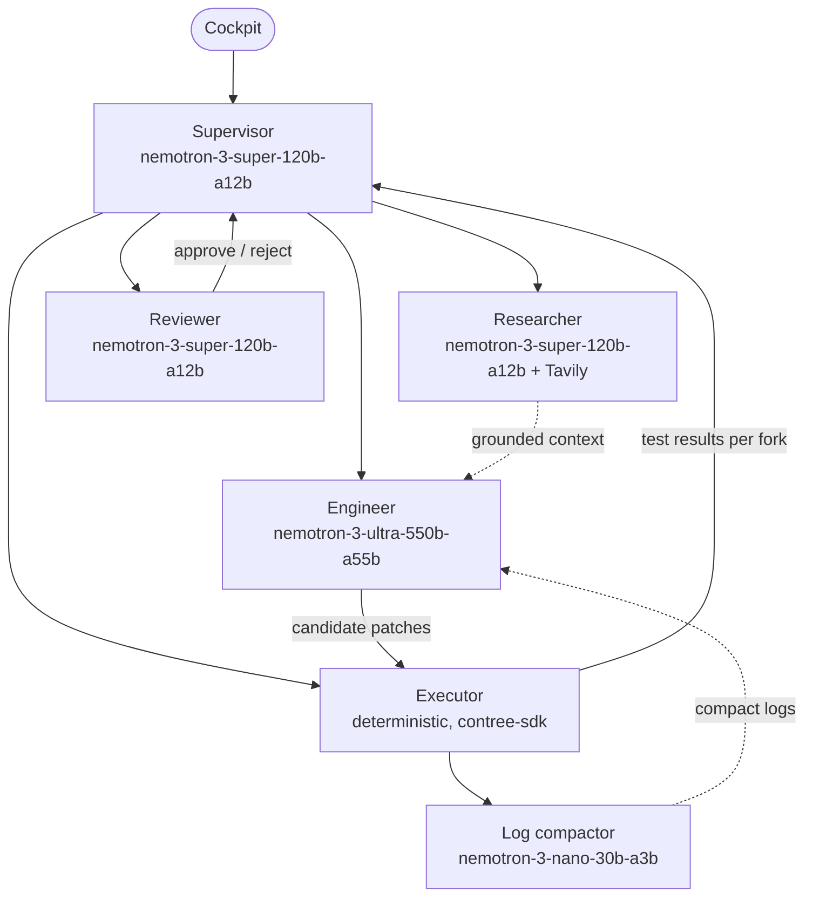

# ARCHON — Agent Roles and Protocols

> **Version:** 2.0.0 (revised after the September 11 audit)
> **Models:** NVIDIA Nemotron 3 on Nebius Token Factory
> **Pattern:** one supervisor, three model-backed roles, one deterministic executor

---

## 1. Topology

The earlier seven-agent design was cut to what the loop actually needs. The supervisor runs on Super because orchestration and tool calling is what Super is built for. Ultra is called exactly once per iteration, for the hard part.



---

## 2. Roles

### 2.1 Supervisor

- **Implementation note (Session 2):** the supervisor's control flow is deterministic Python (`app/core/runner.py`). It does not ask a model which step comes next; the state machine in DESIGN.md section 6 is the policy. Nemotron 3 Super is used by the supervisor only for optional one-line narration (`ARCHON_NARRATE_WITH_SUPER=1`), and by the researcher and reviewer roles below. This is cheaper and auditable.
- **Owns:** the mission state machine, iteration and spend budgets, the decision to stop.
- **Does not:** write code or read the repository directly.
- **Tools:** `run_baseline`, `request_grounding`, `request_patches`, `try_candidates`, `request_review`, `emit_thought`, `finish`.
- **System prompt:**

```text
You are the ARCHON supervisor. You coordinate a software repair mission.
You never write code. You decide which step runs next based on the mission state and the most recent results.
Rules:
- Run the baseline first. If it passes, finish with NOTHING_TO_FIX.
- Request grounding before the first patch attempt.
- Request at most 2 candidate patches per iteration and at most 5 iterations.
- Accept a patch only if the reviewer approves and every originally passing test still passes.
- Stop immediately when told the spend cap was reached and finish with a summary of what was tried.
Emit one short thought before each step so the user can follow along.
```

### 2.2 Researcher

- **Model:** `nvidia/nemotron-3-super-120b-a12b`
- **Owns:** turning an error signature into Tavily queries and turning results into a short grounded brief.
- **Tools:** `tavily_search(query, search_depth="advanced", max_results=5)`, `tavily_extract(url)`.
- **Behavior:** two to three queries per iteration: the exact exception text plus library name, the library's changelog or migration guide for the suspected version, and the exact test failure phrase. Results are returned as a brief with source URLs. Marketing pages are dropped.
- **System prompt:**

```text
You are the ARCHON researcher. Given a failing test output and the libraries involved, write 2 or 3 precise web search queries, call tavily_search for each, and return a brief.
The brief must contain: the likely breaking change with its version, the replacement API or pattern, and the source URLs.
Prefer official documentation, changelogs, and GitHub issues. Ignore marketing content.
If results are inconclusive, say so plainly. Do not invent APIs.
```

### 2.3 Engineer

- **Model:** `nvidia/Nemotron-3-Ultra-550b-a55b`
- **Owns:** root-cause analysis and candidate patches.
- **Inputs:** failing test names and compacted output, source excerpts the executor fetched with `rg` and `sed -n`, the researcher's brief inside an untrusted-context block, and the previous iteration's best attempt with its output.
- **Output:** strict JSON, validated by Pydantic, rejected and retried once on parse failure.

```json
{
  "root_cause": "one paragraph",
  "files_to_read": ["optional: paths the engineer wants before committing to a patch"],
  "candidates": [
    {
      "rationale": "one sentence",
      "edits": [{ "path": "userkit/schemas.py", "search": "exact text copied from the file", "replace": "new text" }],
      "files": [{ "path": "new_file.py", "content": "full content, only for new or very short files" }]
    }
  ]
}
```

**Why edits, not diffs (ADR-012, Session 4).** The first live Nemotron run produced a correct diagnosis five times and a unified diff that `git apply` rejected five times. Model-written hunk headers and context lines are unreliable. Candidates are now exact search-and-replace edits. The executor applies them to the baseline file contents, uploads the resulting files into the fork, and lets `git diff --cached` produce the unified diff shown in the cockpit and passed to the reviewer. A search block that is missing or ambiguous is reported back to the engineer verbatim ("edit 2 for userkit/schemas.py: search block not found; the first search line appears at line 40, the following lines differ") so the next iteration can correct it instead of repeating it.

If `files_to_read` is non-empty and `candidates` is empty, the executor fetches those files and the engineer is called again within the same iteration. At most two such reads per iteration.

- **System prompt:**

```text
You are the ARCHON engineer. You fix failing tests with the smallest correct change.
You receive: failing test output, source excerpts, a research brief marked UNTRUSTED, and the previous attempt if any.
Rules:
- Explain the root cause in one paragraph before proposing changes.
- Propose up to 2 candidates, each a list of exact search-and-replace edits. Candidates should differ in approach, not in formatting.
- Never delete or weaken tests. Never modify files you have not seen.
- Do not invent function names or arguments. If the research brief conflicts with the source you were shown, trust the source and say so.
- If you need to see more files, return them in files_to_read and leave candidates empty.
Output only the JSON object described in the schema.
```

For `MIGRATION` missions the same role receives a different task block: the located client constructions and model literals, the target base URL, and the model mapping table from `pricing.json`.

### 2.4 Executor

- **Model:** none. Deterministic Python using `contree-sdk`.
- **Owns:** every interaction with Token Factory Sandboxes.
- **Operations:** spawn from base image or SWE-bench preloaded image, clone and install, checkpoint, run tests on the baseline, fork per candidate, `git apply --check`, `git apply`, run tests, stream output, parse pytest results, fetch source excerpts with `rg` and `sed -n`.
- **Never:** runs anything on the ARCHON server.

### 2.5 Reviewer

- **Model:** `nvidia/nemotron-3-super-120b-a12b`
- **Owns:** the last check before a patch is shown as verified.
- **Inputs:** the selected patch, the test results, and the root-cause note.
- **Checks:** no test files deleted or assertions weakened, no changes outside the repository, no credential-like strings, changes are plausibly related to the root cause, patch is not disproportionately large.
- **Output:** `{"verdict": "APPROVE" | "REJECT", "reasons": ["..."]}`. A reject sends the mission back to the engineer with the reasons attached.

### 2.6 Log compactor

- **Model:** `nvidia/NVIDIA-Nemotron-3-Nano-30B-A3B` (confirm ID with `GET /v1/models`)
- **Owns:** shrinking long test output to the failing tests, their tracebacks, and the summary line, and extracting pass and fail counts for runners other than pytest.
- **Skipped:** when the raw output is under 4,000 tokens or the runner is pytest with `-q`, which the executor parses directly.

---

## 3. Messages between roles

All roles communicate through the supervisor as typed Pydantic models. There is no free-form agent-to-agent chat. Every message is also persisted as an `Event` row and, where user-visible, emitted on the SSE channel.

```json
{
  "mission_id": "m_8f2c",
  "iteration": 2,
  "from": "executor",
  "to": "supervisor",
  "kind": "ATTEMPT_RESULT",
  "payload": {
    "attempt_id": "a_04",
    "exit_code": 0,
    "fail_to_pass": 3,
    "pass_to_pass_broken": 0,
    "patch_lines": 18,
    "result_image": "img_7a1..."
  }
}
```

---

## 4. Memory

There is no vector index and no cross-mission memory. Within a mission, the supervisor holds: the baseline image ID, the list of attempts with scores, the researcher's brief, and the compacted output of the best attempt so far. That is what the engineer sees on the next iteration. It fits comfortably in context and it is auditable.

---

## 5. Failure handling

| Situation | Behavior |
| :--- | :--- |
| Candidate's search block is missing or ambiguous | Discard, count against the iteration, tell the engineer exactly which edit failed and why on the next call. |
| No candidate passes | Best attempt by score seeds the next iteration. |
| Iteration 5 fails | Mission `FAILED` with a report: root-cause notes per iteration, every patch tried, every test result. |
| Reviewer rejects | Back to the engineer with reasons. Counts as an iteration. |
| Spend cap reached | `ABORTED` with the same report format. |
| Tavily error or timeout | Continue without grounding. Record it in the trace. |
| Sandbox operation exceeds 15 minutes | Cancel the operation, mark the attempt failed with `TIMEOUT`. |
| Ultra unavailable | Retry with backoff three times, then fall back to Super for that iteration and label it in the trace. |
