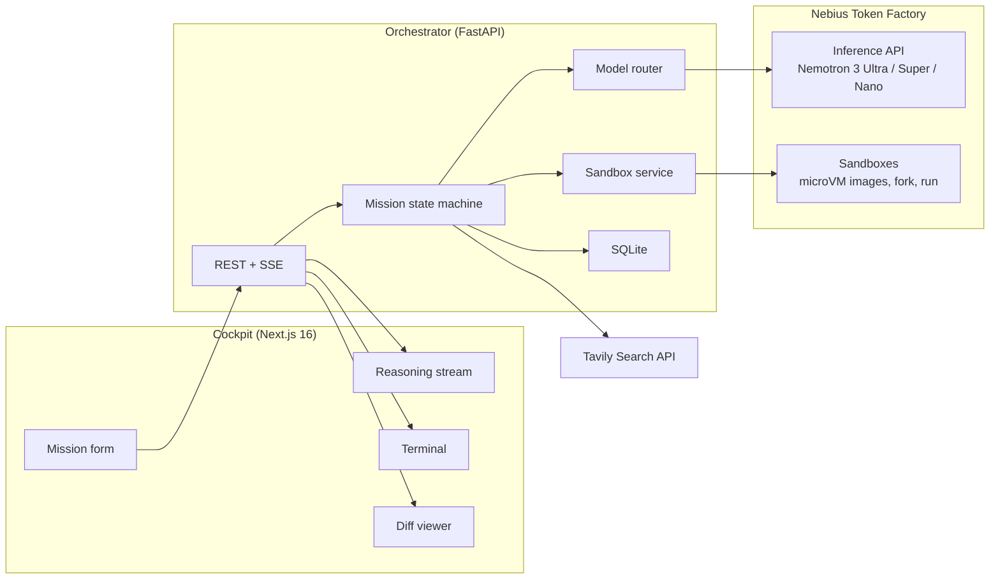
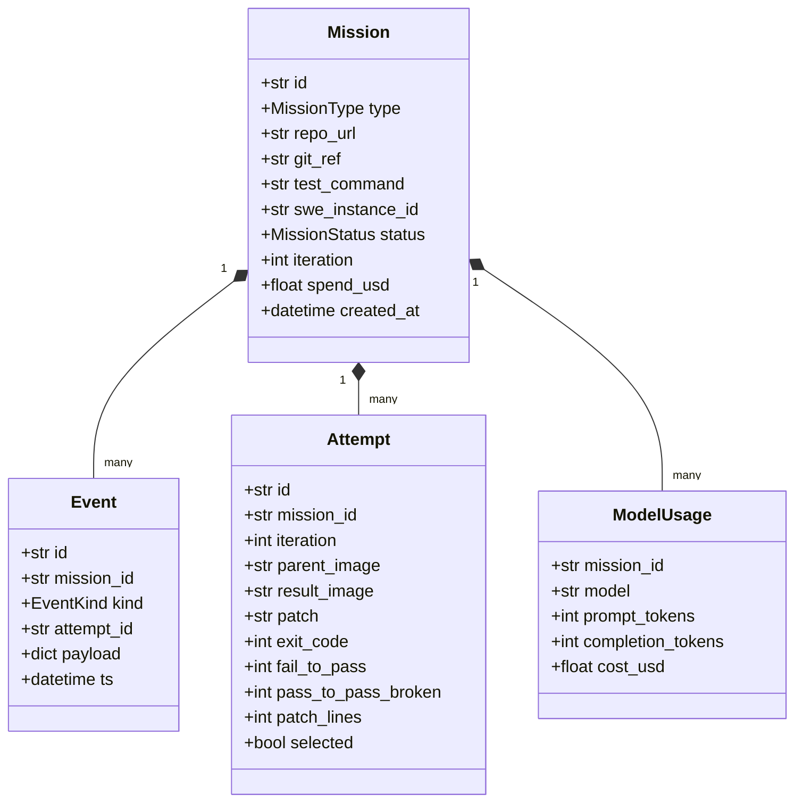
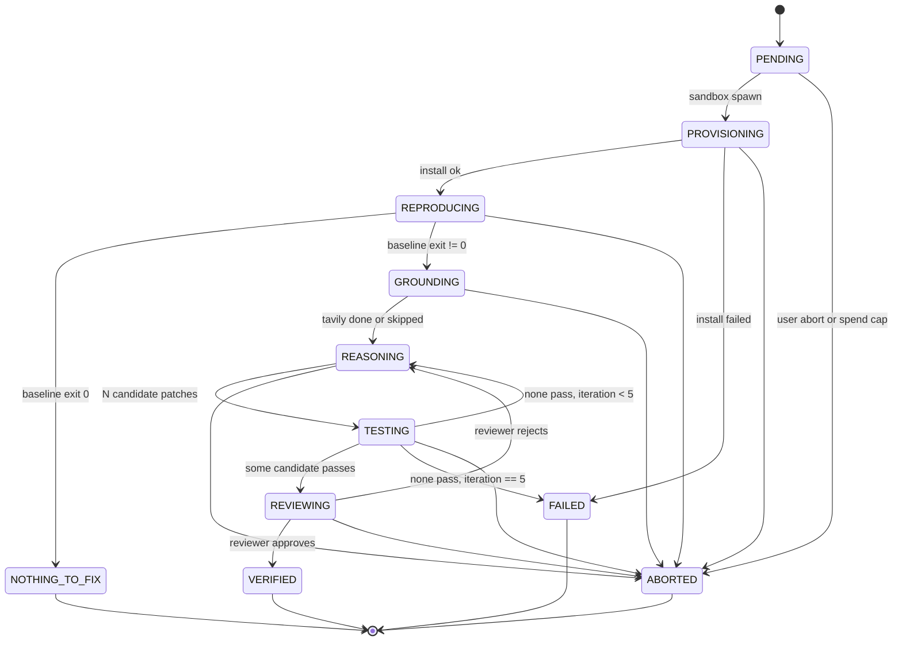

# ARCHON — Technical Design

> **Version:** 2.0.0 (revised after the September 11 audit)
> **Status:** Draft. Sections marked *verify* depend on Sandboxes SDK behavior to be confirmed in week 1.
> **Server:** FastAPI, Python 3.12, `openai` SDK, `contree-sdk`, `tavily-python`, SQLite
> **Client:** Next.js 16, React 19, Tailwind CSS v4, Zustand, `@monaco-editor/react`, `@xterm/xterm`
> **Inference:** Nebius Token Factory, `https://api.tokenfactory.nebius.com/v1/`
> **Execution:** Nebius Token Factory Sandboxes, `https://api.tokenfactory.nebius.com/sandboxes`
> **Grounding:** Tavily Search API

---

## 1. Overview

ARCHON has four parts:

1. **Cockpit.** A Next.js app that submits missions and renders three live streams: agent reasoning, sandbox terminal output, and the resulting diff.
2. **Orchestrator.** A FastAPI service that owns the mission state machine, routes model calls, talks to Sandboxes, and broadcasts events over Server-Sent Events.
3. **Nebius Token Factory.** Inference for all three Nemotron tiers, and Sandboxes for all code execution.
4. **Tavily.** Web grounding called from inside the loop.



---

## 2. Technology choices

### 2.1 Server (`1.platform/server`)

| Concern | Choice | Why |
| :--- | :--- | :--- |
| Framework | FastAPI on Python 3.12 | Async, typed, native SSE via `StreamingResponse`. |
| Inference client | `openai` SDK (`AsyncOpenAI`) with `base_url` set to Token Factory | Token Factory is OpenAI-compatible. No extra dependency. |
| Sandboxes client | `contree-sdk` plus `contree_client.httpx.ContreeAsyncClient` | The official Python SDK for Token Factory Sandboxes. Gives spawn, run, checkpoint, fork, file read and write. |
| Grounding client | `tavily-python` | Official client. |
| Code search inside the sandbox | `rg` and `sed -n` executed in the sandbox | No indexer to build or maintain. Tree-sitter was dropped; `tree-sitter-languages` is unmaintained and the loop does not need an AST. |
| Persistence | SQLite via `aiosqlite` | Missions, events, token usage, recordings. Zero ops. |
| Settings | `pydantic-settings` | Typed environment variables, fails fast on missing keys. |

### 2.2 Client (`1.platform/client`)

| Concern | Choice |
| :--- | :--- |
| Framework | Next.js 16 App Router, React 19 |
| Styling | Tailwind CSS v4, dark theme |
| State | Zustand store fed by a single `EventSource` |
| Terminal | `@xterm/xterm` with `@xterm/addon-fit` |
| Diff | `@monaco-editor/react` `DiffEditor`, one instance per changed file |

---

## 3. Sandboxes integration

This section replaces the earlier Docker and gVisor design. ARCHON does not run containers. It calls the Sandboxes API and Nebius runs the VMs.

### 3.1 Concepts (from the Sandboxes docs)

- An **image** is an immutable filesystem snapshot. Running a command against an image produces a *new* image. The original is untouched.
- **Fork** is free: any image can be the parent of many runs. This replaces `git reset --hard` entirely.
- **Runs** are async operations. You poll or stream their event log until they reach a terminal state.
- Results expose `exit_code`, `stdout`, `stderr`, and the `uuid` of the produced image.
- Published beta limits: 50 concurrent operations, 180-day checkpoint retention.
- Preloaded environments exist for SWE-bench Verified, SWE-rebench, and SWE-rebench-V2.

### 3.2 Client sketch

*Verify import paths and the exact spawn API against the SDK reference in week 1. The shape below follows the getting-started page.*

```python
from contree_client.httpx import ContreeAsyncClient
from contree_sdk import Contree  # verify

class SandboxService:
    def __init__(self, settings: Settings) -> None:
        api = ContreeAsyncClient(settings.nebius_api_key, base_url=settings.nebius_sandbox_url)
        self.sdk = Contree(api)

    async def baseline(self, repo_url: str, ref: str, install: str, test: str) -> Baseline:
        image = await self.sdk.images.use("python:3.12", strict=True)
        r = await image.run(shell=f"git clone --depth 50 {repo_url} /w && cd /w && git checkout {ref} && {install}")
        if r.exit_code != 0:
            raise SandboxError("install failed", r)
        installed = await self.sdk.images.get(r.uuid)          # checkpoint
        t = await installed.run(shell=f"cd /w && {test}")
        return Baseline(image_uuid=installed.uuid, exit_code=t.exit_code, stdout=t.stdout, stderr=t.stderr)

    async def try_patch(self, base_uuid: str, patch: str, test: str) -> Attempt:
        base = await self.sdk.images.get(base_uuid)             # fork point
        await base.files.write("/tmp/archon.patch", patch)       # verify files API
        r = await base.run(shell=f"cd /w && git apply --check /tmp/archon.patch && git apply /tmp/archon.patch && {test}")
        return Attempt(image_uuid=r.uuid, exit_code=r.exit_code, stdout=r.stdout, stderr=r.stderr)
```

Two candidates in the same iteration call `try_patch` concurrently against the same `base_uuid`. Neither can see the other. The loser is simply never referenced again.

### 3.3 Streaming terminal output

The API exposes an operation event log over Server-Sent Events. The sandbox service subscribes to it and re-emits each line as a `terminal` event on the mission's SSE channel, tagged with the attempt ID so the cockpit can show parallel forks in tabs.

### 3.4 Open questions for week 1

- Outbound network from the sandbox for `git clone` and `pip install`. If unavailable, upload a tarball through the files API.
- Per-run wall-clock and memory ceilings. Not published. Assume generous but set our own 15-minute cancel.
- Whether `images.use` on public base images like `python:3.12` resolves without a prior import.

---

## 4. Data model



Enums:

```python
class MissionType(StrEnum):
    BUG_HEALING = "BUG_HEALING"
    MIGRATION = "MIGRATION"

class MissionStatus(StrEnum):
    PENDING = "PENDING"
    PROVISIONING = "PROVISIONING"
    REPRODUCING = "REPRODUCING"
    GROUNDING = "GROUNDING"
    REASONING = "REASONING"
    TESTING = "TESTING"
    REVIEWING = "REVIEWING"
    VERIFIED = "VERIFIED"
    NOTHING_TO_FIX = "NOTHING_TO_FIX"
    FAILED = "FAILED"
    ABORTED = "ABORTED"
```

---

## 5. API

### 5.1 REST

`POST /api/v1/missions`

```json
{
  "type": "BUG_HEALING",
  "repo_url": "https://github.com/owner/repo",
  "git_ref": "main",
  "test_command": "pytest tests/ -x -q",
  "swe_instance_id": null,
  "subdir": "optional/subproject/path for monorepos",
  "hint": "optional pasted stack trace"
}
```

Response `202`:

```json
{ "id": "m_8f2c", "status": "PENDING", "stream": "/api/v1/missions/m_8f2c/events" }
```

`GET /api/v1/missions/{id}` returns the mission, attempts, and usage.
`GET /api/v1/missions/{id}/patch` returns the selected patch as `text/x-patch`.
`POST /api/v1/missions/{id}/abort` stops the mission and cancels running sandbox operations.
`GET /api/v1/replays` lists recorded golden-dataset missions. `POST /api/v1/replays/{id}/play` starts a replay that streams through the same events endpoint.

Live-mode requests must carry `Authorization: Bearer <ARCHON_DEMO_TOKEN>`. Replays do not.

### 5.2 Server-Sent Events

`GET /api/v1/missions/{id}/events`

```
event: status
data: {"status":"REPRODUCING","iteration":0}

event: thought
data: {"stage":"REASONING","model":"nvidia/Nemotron-3-Ultra-550b-a55b","text":"The failing test imports ... which was removed in 2.0. ..."}

event: tavily
data: {"query":"pydantic 2 field_validator replaces validator","results":5,"ms":812}

event: terminal
data: {"attempt":"a_01","stream":"stdout","line":"FAILED tests/test_user.py::test_schema - TypeError ..."}

event: tests
data: {"attempt":"a_01","exit_code":1,"fail_to_pass":0,"pass_to_pass_broken":0,"total":15}

event: patch
data: {"attempt":"a_02","files":[{"path":"app/schemas/user.py","added":6,"removed":4}]}

event: usage
data: {"model":"nvidia/Nemotron-3-Ultra-550b-a55b","prompt_tokens":61234,"completion_tokens":2210,"cost_usd":0.068}

event: done
data: {"status":"VERIFIED","selected_attempt":"a_02","iterations":2,"spend_usd":0.41}
```

---

## 6. Mission state machine



### Candidate scoring

Each attempt is scored as a tuple, compared lexicographically:

1. `pass_to_pass_broken == 0` (hard requirement)
2. `fail_to_pass` count, higher is better
3. `patch_lines`, lower is better

The best attempt's test output seeds the next iteration if nothing passed. Because every attempt is a fork of the same baseline image, there is no rollback step.

### Spend cap

`ModelUsage` rows are summed after every model call. If the total exceeds `ARCHON_MAX_MISSION_USD`, the mission moves to `ABORTED` with a report of what was tried.

---

## 7. Model routing

| Task | Model | Notes |
| :--- | :--- | :--- |
| Root-cause note and candidate patches | `nvidia/Nemotron-3-Ultra-550b-a55b` | The only place Ultra is used. Called once per iteration. |
| Mission supervision, tool-call formatting, Tavily query synthesis, patch review | `nvidia/nemotron-3-super-120b-a12b` | NVIDIA positions Super for multi-agent orchestration and tool use. |
| Test-log compaction, pass/fail extraction for non-pytest runners, commit-message style summaries | `nvidia/NVIDIA-Nemotron-3-Nano-30B-A3B` | Confirm the exact ID with `GET /v1/models`. |

Development runs set `ARCHON_ULTRA_MODEL` to the Super ID so the loop can be exercised cheaply.

### Prompt contract for the patch call

Inputs, each in its own delimited block: failing test names and output, relevant source excerpts fetched with `rg` and `sed -n` inside the sandbox, the Tavily context marked as untrusted, and the previous iteration's best attempt with its test output.

Output, strict JSON validated by Pydantic:

```json
{
  "root_cause": "one paragraph",
  "candidates": [
    { "rationale": "one sentence", "edits": [{ "path": "...", "search": "verbatim source text", "replace": "new text" }] },
    { "rationale": "one sentence", "edits": [ ... ] }
  ]
}
```

Edits are applied server-side to the baseline file contents (each `search` must match exactly once; trailing whitespace differences are tolerated), the resulting files are uploaded into a fork, and `git diff --cached` inside the fork produces the unified diff. A candidate whose search block does not match is discarded, counted against the iteration, and the exact mismatch is fed to the next engineer call. Unified diffs from the model are still accepted as a fallback and applied with `git apply`, then `git apply --3way`.

---

## 8. Observability

Every mission is a LangSmith trace when `LANGSMITH_API_KEY` is set (project `archon` by default). The root span is `archon.mission`, tagged with the mission type and carrying the mission id, repository or SWE-bench instance in metadata. Child spans: `sandbox.provision_repo`, `sandbox.baseline`, `sandbox.try_patch` (tool runs, one per candidate), `researcher.research` with `tavily.search` retriever runs, `engineer.propose`, `reviewer.review`, `compactor.compact`, and `migration.scan` / `migration.parity_sample`. Every Nemotron call is an LLM run with token usage, produced by `wrap_openai` on the Nebius client. Inputs and outputs are scrubbed before upload: `self` and callbacks are dropped, strings are capped at 6,000 characters, and terminal output never leaves the process in full. The trace URL is attached to the `done` event and the mission summary. Without the key every helper is a no-op.

## 9. Security

- The server never executes repository code. All execution is inside Nebius-hosted VMs.
- Mission input is validated: `https://github.com/` URLs only, or a SWE-bench Verified instance ID from the known list. Filesystem paths are rejected.
- Tavily and repository content are always placed in delimited untrusted blocks, never in the system prompt.
- Model tool calls and patch JSON are schema-validated. Anything that does not parse is discarded.
- The reviewer step rejects patches that delete tests, touch files outside the repository, or contain strings that look like credentials.
- No GitHub tokens are accepted or stored. Output is a downloadable patch.
- Public demo defaults to replay mode. Live mode requires a bearer token and honors the spend cap.

---

## 10. Cockpit layout

1. **Header:** mission type, repository, status pill, iteration counter, spend so far.
2. **Left column, reasoning stream:** chronological `thought`, `tavily`, and `status` events with the model badge on each.
3. **Right top, terminal:** xterm.js, one tab per attempt in the current iteration.
4. **Right bottom, diff:** Monaco `DiffEditor` per changed file for the selected attempt, with the `tests` badge.
5. **Footer:** tokens and cost per model, "Download patch", and the `git apply` snippet.

Replay missions render identically. The only difference is a "Replay" label in the header.
