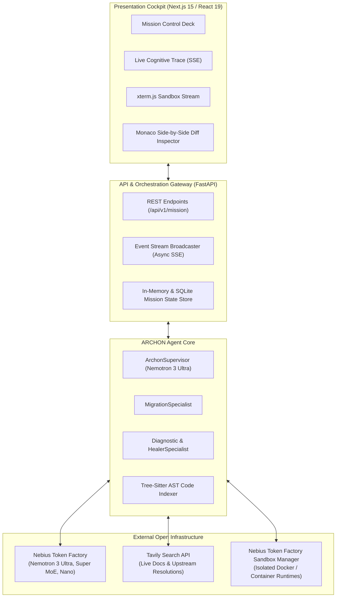
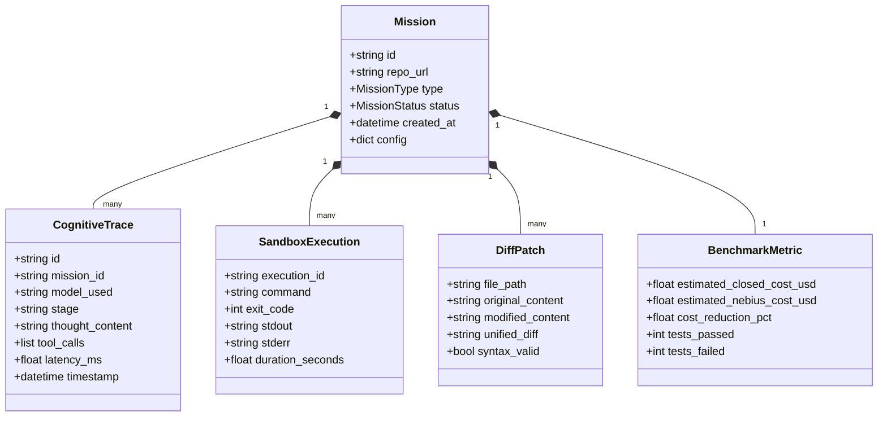
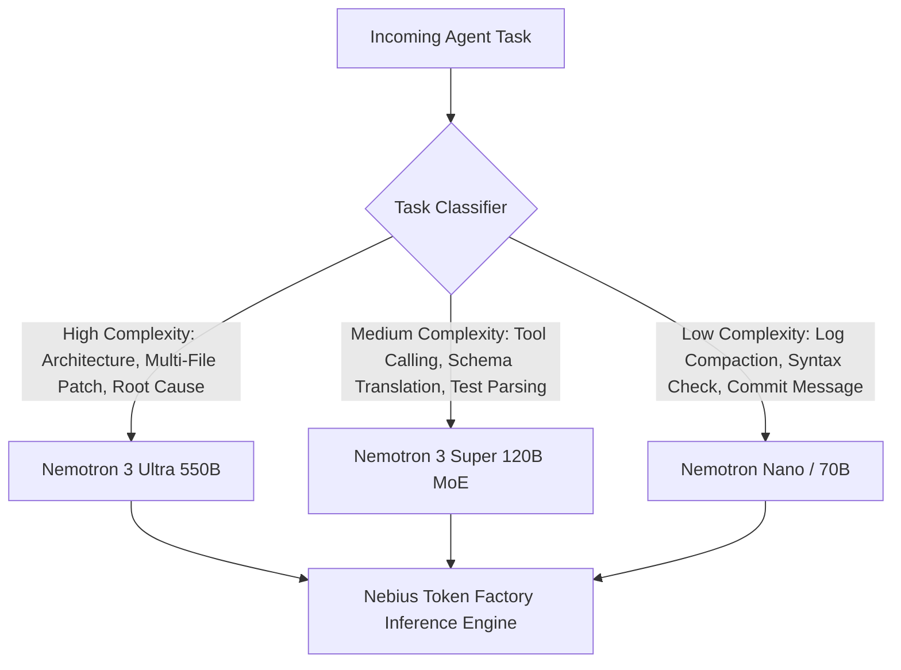
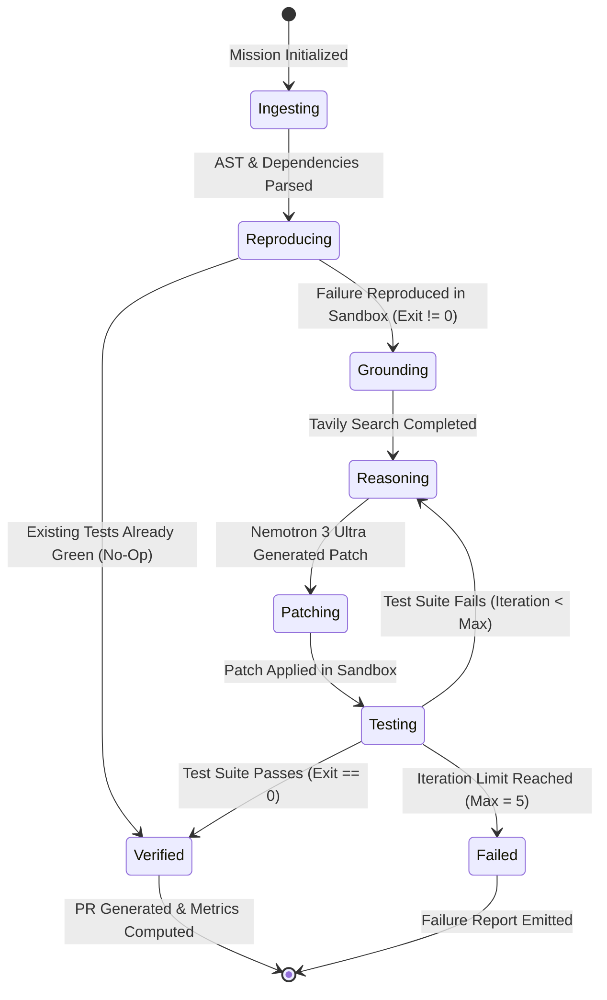

# ARCHON — System Architecture & Technical Design (DESIGN.md)

> **System:** ARCHON (Autonomous Open-Infrastructure Software Engineering & Sovereign AI Migration Engine)  
> **Status:** Production Architecture Blueprint  
> **Backend:** FastAPI (Python 3.11+) | Asynchronous State Machine | Tree-sitter  
> **Frontend:** Next.js 15 (App Router) | React 19 | Tailwind CSS | Monaco Editor | xterm.js  
> **Inference:** Nebius Token Factory (`https://api.tokenfactory.nebius.com/v1`) | NVIDIA Nemotron Triad  
> **Grounding:** Tavily Search API (`https://api.tavily.com/search`)  
> **Sandboxing:** Nebius Token Factory Sandboxes / Docker Ephemeral Micro-Containers  

---

## 1. High-Level Architectural Overview

ARCHON is designed as a **decoupled, event-driven agentic engineering system**. It bridges the gap between high-level reasoning and physical execution by enforcing a strict separation between:
1. **The Cognitive Layer:** Multi-tier reasoning powered by the **NVIDIA Nemotron Triad** on **Nebius Token Factory**.
2. **The Grounding Layer:** Live web intelligence fetched on demand via the **Tavily Search API**.
3. **The Execution Layer:** Isolated, ephemeral micro-containers (**Nebius Token Factory Sandboxes**) where code is compiled, executed, and tested.
4. **The Presentation Cockpit:** A reactive web interface built with **Next.js 15**, streaming live agent reasoning traces (SSE) and container terminal output (xterm.js).



---

## 2. Technology Stack & Component Selection

### 2.1 Backend Core (`1.platform/server`)
* **Framework:** **FastAPI** (Python 3.11+) — Asynchronous, ultra-low overhead, native OpenAPI documentation, and native support for Server-Sent Events (SSE).
* **AI Client:** **OpenAI Python SDK** (Async) — Configured with `base_url="https://api.tokenfactory.nebius.com/v1"` and `api_key=os.environ["NEBIUS_API_KEY"]` to communicate natively with Nebius Token Factory.
* **Grounding Client:** **Tavily Python SDK** (`tavily-python`) — Direct integration with Tavily Search API.
* **Code Parsing & AST:** **Tree-sitter** (`tree-sitter-languages`, `tree-sitter-python`, `tree-sitter-javascript`) — High-speed, language-agnostic AST parsing for static analysis of model imports and dependency graphs.
* **Sandbox Orchestrator:** Python `asyncio.subprocess` wrapper managing isolated ephemeral containers or local Docker microVMs, with strict resource quotas (CPU limits, memory caps, network filtering).

### 2.2 Frontend Cockpit (`1.platform/client`)
* **Framework:** **Next.js 15** with App Router, React 19, and Server Components.
* **Styling:** **Tailwind CSS v4** with a dark, high-contrast engineering aesthetic.
* **Code Diffing:** **@monaco-editor/react** — High-performance VS Code Monaco Diff Editor rendering unified and side-by-side git diffs with full syntax highlighting.
* **Terminal Emulation:** **@xterm/xterm** and `@xterm/addon-fit` — Full ANSI-color terminal emulator streaming live container stdout/stderr.
* **State & Data Fetching:** **Zustand** for local mission state; **EventSource** for consuming Server-Sent Events.

---

## 3. Data Models & Schemas

The system state is structured around strictly typed Pydantic models:



### JSON Schema: Mission State
```json
{
  "$schema": "http://json-schema.org/draft-07/schema#",
  "title": "MissionState",
  "type": "object",
  "properties": {
    "mission_id": { "type": "string" },
    "repo_path": { "type": "string" },
    "mission_type": { "enum": ["MIGRATION", "BUG_HEALING", "DEPENDENCY_UPGRADE"] },
    "current_status": { "enum": ["PENDING", "INGESTING", "REPRODUCING", "GROUNDING", "REASONING", "PATCHING", "TESTING", "VERIFIED", "FAILED"] },
    "active_model": { "type": "string" },
    "iteration_count": { "type": "integer" },
    "max_iterations": { "type": "integer", "default": 5 },
    "diffs": {
      "type": "array",
      "items": {
        "type": "object",
        "properties": {
          "file_path": { "type": "string" },
          "diff": { "type": "string" }
        }
      }
    },
    "metrics": {
      "type": "object",
      "properties": {
        "cost_savings_pct": { "type": "number" },
        "tests_passed": { "type": "integer" },
        "tests_total": { "type": "integer" }
      }
    }
  },
  "required": ["mission_id", "mission_type", "current_status"]
}
```

---

## 4. API Specification & Communication Protocols

### 4.1 REST Endpoints

#### `POST /api/v1/mission/create`
Initiates a new autonomous engineering mission.
* **Request:**
  ```json
  {
    "repo_url": "https://github.com/acme-org/rag-service.git",
    "mission_type": "MIGRATION", // or "BUG_HEALING", "MODERNIZATION"
    "issue_description": "Migrate from OpenAI gpt-4o to Nebius Token Factory Nemotron 3 Ultra",
    "test_command": "pytest tests/"
  }
  ```
* **Response:**
  ```json
  {
    "mission_id": "m-891f7a2c",
    "status": "INGESTING",
    "stream_url": "/api/v1/mission/m-891f7a2c/stream"
  }
  ```

#### `GET /api/v1/mission/{mission_id}/diff`
Returns the verified unified git diff and side-by-side patch data for the Monaco Editor.

#### `POST /api/v1/mission/{mission_id}/dispatch-pr`
Dispatches a verified Pull Request directly to GitHub using the user's provided personal access token.

### 4.2 Server-Sent Events (SSE) Streaming Protocol
`GET /api/v1/mission/{mission_id}/stream` streams real-time state events over HTTP:

```
event: thought
data: {"stage": "PLANNING", "model": "nvidia/nemotron-3-ultra-550b", "content": "Analyzing repository AST. Identified 4 modules with direct OpenAI client dependencies."}

event: tavily_search
data: {"query": "Nebius Token Factory OpenAI compatible API streaming migration", "results_count": 5}

event: terminal_output
data: {"stream": "stderr", "line": "pytest tests/test_rag.py\n================ FAILURES ================\n"}

event: test_result
data: {"passed": 14, "failed": 1, "status": "FAILING"}

event: patch_applied
data: {"file": "src/client.py", "lines_added": 8, "lines_removed": 4}

event: verified
data: {"tests_passed": 15, "tests_failed": 0, "cost_reduction_pct": 73.4, "status": "COMPLETED"}
```

---

## 5. Cognitive Triad Routing Logic & Prompt Architecture

### 5.1 The Multi-Tier Model Strategy
To achieve the optimal balance between reasoning accuracy and inference efficiency, ARCHON implements dynamic model dispatching:



### 5.2 System Prompts & Output Contracts

#### Master Architect Prompt (`Nemotron 3 Ultra 550B`)
```text
You are ARCHON MASTER ARCHITECT, a world-class autonomous software engineer operating on open infrastructure (Nebius Token Factory).

YOUR OBJECTIVES:
1. Deduce the exact root cause of repository failures across multi-file dependencies.
2. Refactor proprietary LLM dependencies (OpenAI/Anthropic) to Nebius Token Factory (https://api.tokenfactory.nebius.com/v1) and NVIDIA Nemotron models.
3. Formulate minimal, surgical, regression-free unified diffs.

INPUTS PROVIDED:
- Target Repository AST & File Map
- Failing Sandbox Execution Log (Stdout / Stderr)
- Grounded Real-Time Web Intelligence from Tavily Search

RULES:
- Never guess line numbers or invent nonexistent API arguments.
- Always output clean, syntactically valid JSON containing an array of unified file diffs.
- Adhere strictly to the requested open-source target architecture.
```

---

## 6. The Closed-Loop Self-Healing State Machine

The core intelligence of Archon resides in its self-correcting state machine:



### Convergence & Rollback Invariant
* If an applied patch increases the number of failing test cases, the state machine rolls back the git workspace inside the sandbox to the previous iteration before requesting a refined diff from Nemotron 3 Ultra.
* This guarantees that code never degrades across iterations.

---

## 7. Sandbox & Security Architecture

ARCHON executes untrusted code safely by strictly adhering to the **NVIDIA OpenShell** isolation guidelines:

```
+-------------------------------------------------------------+
| HOST OS (Linux / macOS)                                     |
|                                                             |
|  +-------------------------------------------------------+  |
|  | NEBIUS TOKEN FACTORY SANDBOX CONTAINER (Docker/gVisor)|  |
|  |                                                       |  |
|  |  * Non-Root Execution User (uid: 1000)                |  |
|  |  * Memory Limit: 4096 MB                              |  |
|  |  * CPU Limit: 2.0 Cores                               |  |
|  |  * Ephemeral Tmpfs Storage (Discarded on teardown)    |  |
|  |  * Outbound Egress Filter: Block private RFC1918 IPs  |  |
|  |  * Read-Only Host Filesystem Mounting                 |  |
|  |  * Execution Timeout: 180s per command                |  |
|  +-------------------------------------------------------+  |
+-------------------------------------------------------------+
```

---

## 8. Monaco Diff & Developer Cockpit Layout

The frontend cockpit is organized into four synchronized viewports:

1. **Top Bar:** Repository context, active Nebius Token Factory connection status, active NVIDIA Nemotron model badge, and mission action triggers.
2. **Left Panel (Cognitive Stream):** Chronological, streaming log of agent reasoning, Tavily web searches, and model routing decisions.
3. **Right Top Panel (Sandbox Terminal):** Real-time ANSI xterm.js terminal displaying container spin-up, package installs, and `pytest` / `npm test` stdout.
4. **Right Bottom Panel (Monaco Diff Inspector):** VS Code-grade side-by-side diff viewer showing exact additions and deletions across all affected files.
5. **Bottom Impact Bar:** Calculated token economics, speedup benchmarks, and the **"Create GitHub Pull Request"** CTA.
