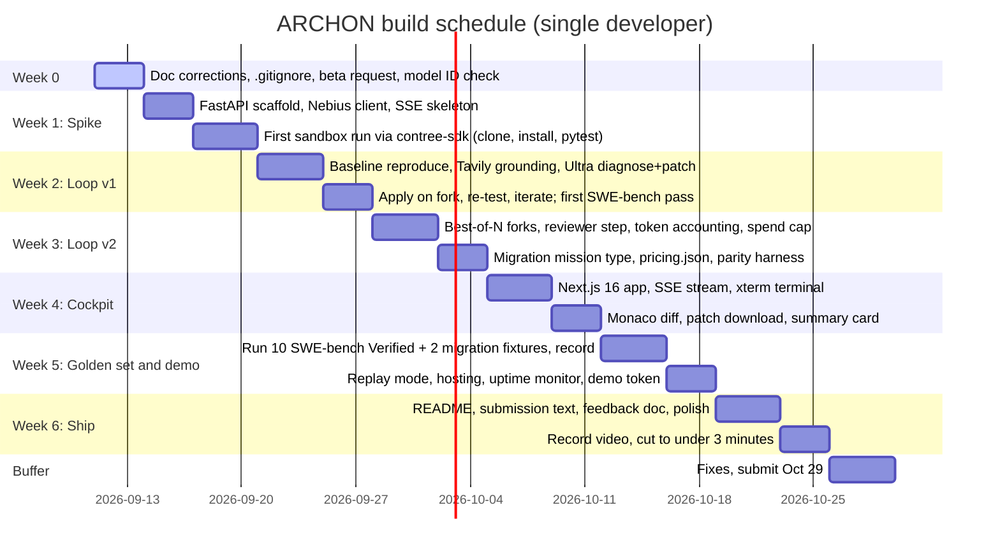

# ARCHON — Implementation Plan

> **Version:** 2.0.0 (revised after the September 11 audit)
> **Deadline:** Friday, October 30, 2026, 10:00 AM PDT. Internal target: submit Thursday, October 29.
> **Team:** one developer. Every estimate below assumes that.
> **Judging window:** December 1 to December 15, 2026. The demo must stay up through it.

---

## 1. Principles

1. Get one real Nemotron call and one real sandbox run working end to end before writing any UI.
2. Develop on Nemotron 3 Super and Nano. Use Ultra only for golden-dataset runs and the video.
3. Record every golden-dataset run so the public demo can replay it without spending credits.
4. Log Nebius and NVIDIA friction in `2.submission/FEEDBACK.md` the day it happens.
5. Cut before the deadline slips. The cut list is in section 5.

---

## 2. Schedule

---

## 3. Work breakdown

### Week 0 (Sep 11 to Sep 13): Foundations
- [x] Audit and correct all documentation. Remove false completion claims.
- [x] Add `.gitignore`, remove stray directories, fill empty READMEs.
- [x] Start `2.submission/FEEDBACK.md`.
- [ ] Request Token Factory Sandboxes beta access. Email `contree@nebius.com` if self-serve stalls.
- [ ] Claim both $25 credits. Run `GET /v1/models?verbose=true` and record the exact Nemotron IDs and prices in `pricing.json`.
- [ ] Decide city affiliation for the submission form.

### Week 1 (Sep 14 to Sep 20): Spike
- [x] `1.platform/server`: FastAPI app, Pydantic settings, `/healthz`, SSE endpoint that emits a heartbeat.
- [x] Nebius client wrapper over the OpenAI SDK with per-call token and cost accounting.
- [x] `contree-sdk` wrapper: spawn from a base image, run a shell command, read exit code and output, checkpoint, fork.
- [x] End-to-end spike script: `tests/golden/run.py` clones a fixture, installs, runs pytest, streams output. Verified on the local backend; Sandboxes run pending beta access.
- [ ] **Gate:** one Nemotron call and one sandbox test run succeed from the same process. If Sandboxes access is not granted by Sep 20, escalate on Discord and fall back to the SWE-bench preloaded images only.

### Week 2 (Sep 21 to Sep 27): Loop v1
- [x] Mission state machine with the states in `DESIGN.md` section 6.
- [x] Baseline reproduction and test-result parsing (pytest first; Nano-assisted parsing for other runners).
- [x] Tavily grounding: query synthesis, search with timeout, delimited context injection.
- [x] Ultra diagnose-and-patch prompt returning structured JSON diffs.
- [x] Apply on fork, re-test, iterate up to 5.
- [ ] **Gate:** one SWE-bench Verified instance resolved end to end from the CLI.

### Week 3 (Sep 28 to Oct 4): Loop v2
- [x] Best-of-N: two candidate patches per iteration, each on its own fork, scored and selected.
- [x] Reviewer step on Super: checks the diff for secrets, unrelated changes, and test deletions.
- [x] LangSmith tracing across the loop (optional, key-gated).
- [x] Spend cap and iteration cap enforced with a readable failure report.
- [x] Migration mission type: ripgrep locators, rewrite prompt, `pricing.json`, parity harness.
- [ ] **Gate:** 3 of 5 tried SWE-bench instances resolve; one migration fixture passes.

### Week 4 (Oct 5 to Oct 11): Cockpit
- [x] Next.js 16 app with Tailwind v4 and Zustand.
- [x] Mission form with SWE-bench dropdown and GitHub URL input.
- [x] Reasoning stream and xterm.js terminal fed by SSE.
- [x] Monaco side-by-side diff, patch download, `git apply` snippet, summary card.
- [x] **Gate:** full mission visible in the browser without opening a terminal. Verified September 11 with the recorded local run replayed through the live server into the cockpit.

### Week 5 (Oct 12 to Oct 18): Golden set and demo
- [ ] Run the golden dataset on Ultra. Record every trace to `tests/golden/recordings/`.
- [x] Replay mode that streams recordings through the same SSE channel.
- [ ] Deploy: client on Vercel, server on Railway or Nebius Serverless Endpoints. Replay by default, live mode behind `ARCHON_DEMO_TOKEN`.
- [ ] Uptime monitor pointing at the demo.
- [ ] **Gate:** a stranger can open the demo URL and watch a full mission replay.

### Week 6 (Oct 19 to Oct 25): Ship
- [ ] README rewritten against what actually exists. Tick checklist items only when verified.
- [ ] `2.submission/README.md` finalized. Strongest feedback entries pulled in.
- [ ] Video: one live Ultra run on a SWE-bench instance, one migration replay, architecture slide. Under 3 minutes. No copyrighted audio.

### Buffer (Oct 26 to Oct 29)
- [ ] Fix whatever broke. Submit on Oct 29.

---

## 4. Budget

| Resource | Available | Plan |
| :--- | :--- | :--- |
| Token Factory credits | $50 ($25 Builders Program + $25 code `NEBIUS-DEVPOST-GLOBAL26`) | Development on Super and Nano. Ultra reserved for roughly 12 golden runs and the video. Per-mission cap $3 in dev, $8 for final runs. Buy more credit if the golden set needs it; do not skip the golden set. |
| Token Factory Sandboxes | Free during beta | Use freely, but 50 concurrent operations is the published ceiling. |
| Tavily | $25 credit | Roughly 1,000 advanced searches. Cache results per query hash during development. |
| Hosting | Vercel free tier for the client; Railway or Nebius Serverless for the server | Must remain up through Dec 15. Budget for a paid tier if free tiers sleep. |
| LangSmith | $100 credit | Tracing of every mission: root span per mission, child spans per role, sandbox tool run, Tavily query, and Nemotron call with token usage. Used for debugging prompts during the golden runs. |
| Toloka, Tandem credits | Available | Not used. |

Estimated Ultra cost per mission at current list prices: a 5-iteration mission with roughly 400K input and 40K output tokens is about $0.50 to $0.60. The $3 cap gives headroom for long repositories.

---

## 5. Cut list, in order

If the schedule slips, remove from the bottom up:

1. TypeScript support in migration.
2. Parity harness (keep the caveat text in the UI).
3. Best-of-N forks (fall back to one candidate per iteration).
4. Migration mission type entirely.
5. Monaco diff (fall back to a unified diff in a `<pre>` block).

Never cut: sandbox execution, Tavily in the loop, Ultra for patching, replay mode, the video.

---

## 6. Risks

| Risk | Likelihood | Impact | Mitigation |
| :--- | :---: | :---: | :--- |
| Sandboxes beta access delayed or denied | Medium | Critical | Request on day 0. Escalate via Discord and `contree@nebius.com`. Fallback: SWE-bench preloaded images only. |
| Credit exhaustion before the golden set | Medium | High | Develop on Super and Nano; hard caps; record and replay; buy credits if needed. |
| Solo bandwidth | High | High | Cut list above. Gates each week. |
| Demo goes down during judging | Medium | High | Replay mode has no external dependencies; uptime monitor; paid hosting tier. |
| Model output non-deterministic during live video take | High | Medium | Record several takes; replay mode as backup for the video. |
| Nebius rate limits or model outage | Low | Medium | Exponential backoff; route to Super when Ultra is unavailable; readable failure report. |
| Tavily timeout | Low | Low | 10-second timeout; continue without grounding; note it in the trace. |
| Malicious code in a target repository | Low | Medium | Everything runs in Nebius-hosted VMs; server never executes repo code; public URLs and SWE-bench IDs only. |
| Sandboxes have no outbound network for `git clone` | Unknown | High | Verify in week 1. Fallback: upload a tarball via the files API. |
