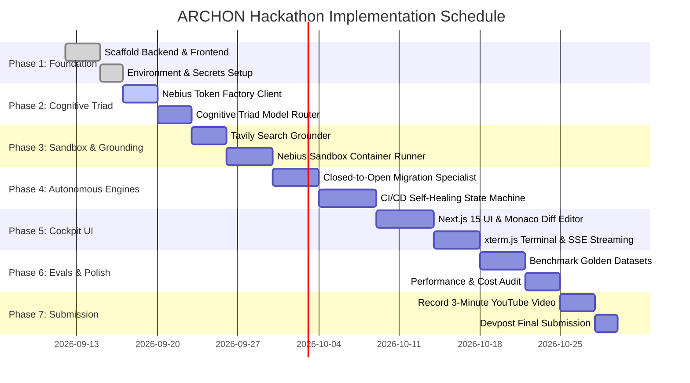

# ARCHON — Master Implementation Plan & Roadmap (PLAN.md)

> **Document Version:** 1.0.0  
> **Target Deadline:** Friday, October 30, 2026 @ 10:00 AM PDT (1:00 PM EDT)  
> **Status:** Active Execution Roadmap  
> **Primary Milestone:** Grand Prize Submission on Devpost  

---

## 1. Master Timeline & Phase Overview

---

## 2. Work Breakdown Structure (WBS) & Milestones

### Phase 1: Project Foundation & Scaffolding (Days 1–5)
* [x] **M1.1: Repository Setup:** Configure project structure (`0.docs/`, `1.platform/client/`, `1.platform/server/`), open-source license (Apache 2.0), and git hooks.
* [x] **M1.2: FastAPI Scaffolding:** Create asynchronous FastAPI server with Pydantic v2 schemas, CORS configuration, and modular routing layout.
* [x] **M1.3: Next.js 15 Cockpit Setup:** Initialize Next.js 15 App Router client with Tailwind CSS v4, Lucide icons, and layout structure.
* [x] **M1.4: Environment & Secrets Manager:** Centralize configuration for `NEBIUS_API_KEY`, `TAVILY_API_KEY`, and `LANGSMITH_API_KEY`.

### Phase 2: Nebius Token Factory & Cognitive Triad (Days 6–10)
* [ ] **M2.1: Nebius OpenAI Client Integration:** Connect to `https://api.tokenfactory.nebius.com/v1` via the async OpenAI SDK.
* [ ] **M2.2: Cognitive Triad Dispatcher:** Build dynamic router mapping high-level tasks to **Nemotron 3 Ultra (550B)**, tool calls to **Nemotron 3 Super (120B MoE)**, and fast tasks to **Nemotron Nano**.
* [ ] **M2.3: Streaming SSE Protocol:** Implement Server-Sent Events endpoint emitting real-time agent thoughts, active model tags, and latency metrics.

### Phase 3: Tavily Grounding & Sandbox Execution (Days 11–16)
* [ ] **M3.1: Tavily Grounding Engine:** Integrate `tavily-python` SDK to formulate technical queries, search docs, and synthesize code snippets.
* [ ] **M3.2: Ephemeral Sandbox Runner:** Implement secure container execution engine capable of running shell commands, package managers, and test suites with strict timeout caps (180s) and memory limits (4GB).
* [ ] **M3.3: Live Terminal Bridge:** Pipe sandbox stdout and stderr to the frontend via SSE and render in xterm.js.

### Phase 4: Autonomous Migration & Self-Healing Engines (Days 17–24)
* [ ] **M4.1: AST Repository Scanner:** Implement Tree-sitter parsers to identify OpenAI/Anthropic SDK dependencies, prompt templates, and function schemas.
* [ ] **M4.2: Migration Specialist:** Develop automated translation rules rewriting client calls to Nebius Token Factory with Nemotron models.
* [ ] **M4.3: Self-Healing State Machine:** Implement the closed-loop convergence algorithm: Ingest ➔ Reproduce ➔ Ground ➔ Patch ➔ Verify ➔ Rollback on failure.

### Phase 5: Developer Cockpit & Monaco Diff Interface (Days 25–31)
* [ ] **M5.1: Monaco Diff Component:** Embed `@monaco-editor/react` to display interactive side-by-side git diffs with syntax highlighting.
* [ ] **M5.2: Mission Control Deck:** Build repository ingestion bar, track selector, and one-click mission triggers.
* [ ] **M5.3: ROI & Cost Metrics Card:** Compute before/after token economics (65%–80% savings) and display real-time latency improvements.
* [ ] **M5.4: One-Click PR Dispatcher:** Implement GitHub API integration to commit verified branches and open Pull Requests directly from the UI.

### Phase 6: Golden Datasets, Benchmarks & Hardening (Days 32–36)
* [ ] **M6.1: Golden Dataset 1 (Migration):** Verify automated migration of a complete OpenAI RAG pipeline to Nebius Token Factory with 100% test pass rate.
* [ ] **M6.2: Golden Dataset 2 (Self-Healing):** Verify automated diagnosis and repair of a breaking Pydantic v2 dependency crash.
* [ ] **M6.3: Token Cost & Latency Benchmark:** Produce verified benchmark tables demonstrating cost and speedup metrics.

### Phase 7: Demo Video, Documentation & Devpost Submission (Days 37–40)
* [ ] **M7.1: Demonstration Video:** Record high-definition, under 3-minute video showing:
  - Repository ingestion.
  - Live Tavily grounding and Nemotron 3 Ultra reasoning stream.
  - Sandbox terminal execution turning from RED to GREEN.
  - Interactive Monaco diff and one-click PR dispatch.
* [ ] **M7.2: Devpost Final Submission:** Draft comprehensive Devpost entry, select **Track 1**, submit technical feedback, and complete submission before **October 30, 2026 @ 10:00 AM PDT**.

---

## 3. Resource Allocation & Credit Budget

| Resource / Partner | Allocated Credit | Strategic Usage |
| :--- | :--- | :--- |
| **Nebius Token Factory** | $50 USD ($25 Builders + $25 Code `NEBIUS-DEVPOST-GLOBAL26`) | High-throughput streaming inference for Nemotron 3 Ultra, Super, and Nano during development and live demo. |
| **Tavily Search API** | $25 USD (Nebius Builder Program) | Grounding queries for upstream documentation and bug resolution. |
| **LangSmith (LangChain)** | $100 USD (Nebius Builder Program) | Full agent trace observability, latency profiling, and evaluation logging. |
| **Toloka & Tandem** | $100 USD (Nebius Builder Program) | Human-in-the-loop edge case verification and dataset curation. |

---

## 4. Risk Matrix & Mitigation Strategy

| Risk Event | Severity | Probability | Mitigation Strategy |
| :--- | :---: | :---: | :--- |
| **Nebius Token Factory Rate Limits** | High | Low | Implement exponential backoff, request batching, and fallback routing to Nemotron 3 Super. |
| **Infinite Self-Healing Loop** | Medium | Medium | Strict hard limit of 5 iterations maximum; automatic workspace rollback on degradation. |
| **Malicious Code in Target Repo** | Critical | Low | Sandboxes execute with non-root user privileges, memory caps, and restricted egress networking. |
| **Tavily API Network Timeout** | Medium | Low | 5-second timeout on search requests with graceful fallback to cached documentation. |
