# ARCHON — Comprehensive Verification & Testing Suite (TESTING.md)

> **Document Version:** 1.0.0  
> **Testing Philosophy:** Zero-Trust, Closed-Loop Verification  
> **Core Guarantee:** No code is ever presented to the user or submitted as a Pull Request unless it has achieved **100% test-suite green status** inside an isolated container sandbox.  

---

## 1. The Verification Pyramid

ARCHON enforces a four-tiered verification pyramid:

```
                  / \
                 /   \
                / E2E \       Tier 4: Golden Datasets (Full Migration & Self-Healing)
               / Sandbox\
              /-----------\
             / Integration \   Tier 3: Live Nebius & Tavily API Handshakes
            /---------------\
           /   Unit Tests    \ Tier 2: Model Routers, AST Parsing, Diff Syntax
          /-------------------\
         / Static Type & Lint  \ Tier 1: Ruff, MyPy, TypeScript Strict Mode
        /-----------------------\
```

---

## 2. Test Specifications by Tier

### Tier 1: Static Analysis, Type Safety & Linting
* **Python Backend (`1.platform/server`):**
  - **Ruff:** Comprehensive linting adhering to strict PEP 8, flake8, and import sorting rules:
    ```bash
    ruff check .
    ruff format --check .
    ```
  - **MyPy:** Strict static type analysis across all Pydantic schemas and async orchestration engines:
    ```bash
    mypy --strict app/
    ```
* **Frontend Cockpit (`1.platform/client`):**
  - **ESLint & TypeScript:** Zero `any` types permitted in mission-critical data pathways:
    ```bash
    npm run lint
    npx tsc --noEmit
    ```

---

### Tier 2: Unit Testing Suite

#### 1. Cognitive Triad Router Tests (`tests/unit/test_router.py`)
* `test_route_ultra_for_architecture_planning`: Confirms that tasks requiring multi-file dependency analysis dispatch to `nvidia/nemotron-3-ultra-550b`.
* `test_route_super_for_tool_execution`: Confirms that function parameter extraction and structured JSON calls dispatch to `nvidia/nemotron-3-super-120b`.
* `test_route_nano_for_log_compaction`: Confirms that raw terminal log filtering and syntax linting dispatch to `nvidia/nemotron-nano`.

#### 2. AST Repository Indexer Tests (`tests/unit/test_indexer.py`)
* `test_detect_openai_imports`: Verifies that Tree-sitter accurately identifies `from openai import OpenAI` across Python source trees.
* `test_detect_anthropic_imports`: Verifies detection of `Anthropic()` client initializations.
* `test_map_test_suite_runner`: Verifies automated detection of test runners (`pytest`, `unittest`, `npm test`, `jest`).

#### 3. Tavily Grounder Tests (`tests/unit/test_tavily.py`)
* `test_query_synthesis_from_stacktrace`: Verifies that raw stack traces are distilled into clean, keyword-dense search queries.
* `test_tavily_response_parsing`: Confirms that raw JSON payloads from Tavily are parsed into clean markdown context snippets.

#### 4. Sandbox Runner Tests (`tests/unit/test_sandbox.py`)
* `test_sandbox_timeout_enforcement`: Asserts that commands running longer than 180 seconds are forcefully terminated with a `TimeoutError`.
* `test_sandbox_memory_limit`: Verifies that processes attempting to allocate >4GB RAM are constrained without crashing the host.
* `test_git_patch_application_and_rollback`: Tests that `git apply` applies cleanly, and `git reset --hard` restores pristine workspace state on failure.

---

### Tier 3: Live Integration Testing Suite

Integration tests verify live connections against external open infrastructure:

#### 1. Nebius Token Factory Handshake (`tests/integration/test_nebius_live.py`)
```python
import os
import pytest
from openai import AsyncOpenAI

@pytest.mark.asyncio
async def test_nebius_token_factory_live_completion():
    api_key = os.environ.get("NEBIUS_API_KEY")
    assert api_key is not None, "NEBIUS_API_KEY must be set"

    client = AsyncOpenAI(
        base_url="https://api.tokenfactory.nebius.com/v1",
        api_key=api_key
    )

    response = await client.chat.completions.create(
        model="nvidia/nemotron-3-super-120b",
        messages=[{"role": "user", "content": "Respond with: PING_OK"}],
        max_tokens=10
    )

    assert "PING_OK" in response.choices[0].message.content
```

#### 2. Tavily Search API Handshake (`tests/integration/test_tavily_live.py`)
```python
import os
import pytest
from tavily import TavilyClient

def test_tavily_live_search():
    api_key = os.environ.get("TAVILY_API_KEY")
    assert api_key is not None, "TAVILY_API_KEY must be set"

    client = TavilyClient(api_key=api_key)
    results = client.search(
        query="Nebius Token Factory API documentation",
        max_results=2
    )

    assert len(results["results"]) > 0
    assert "tokenfactory" in str(results).lower() or "nebius" in str(results).lower()
```

---

### Tier 4: Golden Dataset End-to-End Scenarios

The golden dataset consists of real-world repository challenges designed to stress-test Archon's capabilities:

```mermaid
flowchart TD
    subgraph Golden_Suite_1 ["Scenario 1: Closed-to-Open AI Migration"]
        Repo1["Target: PyTorch RAG Pipeline with OpenAI SDK"]
        Archon1["Archon Action: Refactor to Nebius Token Factory + Nemotron"]
        Verify1["Verification: 15/15 pytest fixtures green + 74% cost reduction"]
    end

    subgraph Golden_Suite_2 ["Scenario 2: Autonomous Bug Self-Healing"]
        Repo2["Target: FastAPI Service broken by Pydantic v2 break"]
        Archon2["Archon Action: Tavily Grounding + Nemotron 3 Ultra Patch"]
        Verify2["Verification: Red build (exit 1) ➔ Green build (exit 0)"]
    end

    subgraph Golden_Suite_3 ["Scenario 3: Security & Sandboxing Guardrail"]
        Repo3["Target: Untrusted code with unauthorized network egress"]
        Archon3["Archon Action: OpenShell Sandbox Egress Filtering"]
        Verify3["Verification: Exploit safely neutralized; container isolated"]
    end

    Repo1 --> Archon1 --> Verify1
    Repo2 --> Archon2 --> Verify2
    Repo3 --> Archon3 --> Verify3
```



---

## 3. Quantitative Evaluation Metrics & Scoring Criteria

Every mission executed by Archon is evaluated on four measurable dimensions:

| Metric | Target | Measurement Method |
| :--- | :---: | :--- |
| **Test Verification Rate** | **100%** | Sandbox exit code == 0 across all unit and integration test fixtures. |
| **Convergence Efficiency** | **<= 3 Iterations** | Number of patch-and-test loops required before full test pass. |
| **Token Cost Reduction** | **65% – 80%** | Calculated savings comparing closed proprietary list pricing to Nebius Token Factory pricing. |
| **Time-To-First-Token (TTFT)** | **< 600ms** | Measured latency on streaming Nemotron 3 Super and Ultra inference calls. |
| **Regression Count** | **0** | Verification that zero previously passing tests were broken by the patch. |

---

## 4. How to Execute the Full Test Suite

```bash
# 1. Activate virtual environment
cd 1.platform/server
source venv/bin/activate

# 2. Run all unit tests
pytest tests/unit -v

# 3. Run integration tests with live Nebius & Tavily credentials
NEBIUS_API_KEY="your_key" TAVILY_API_KEY="your_key" pytest tests/integration -v

# 4. Run full Golden Dataset E2E verification
pytest tests/e2e/test_golden_scenarios.py -v --run-sandbox
```
