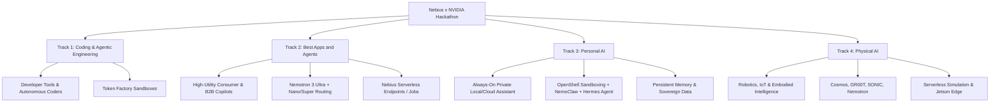
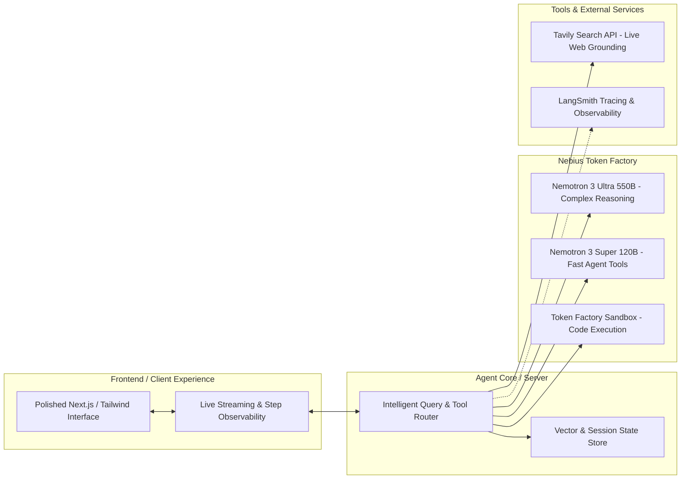

# Nebius x NVIDIA Global AI Hackathon — Comprehensive Master Dossier

> **Official Theme:** *"Build the next frontier of AI on open infrastructure"*  
> **Platform & Host:** Devpost & Nebius B.V. in partnership with NVIDIA  
> **Official Devpost Portal:** [https://nebiusglobalaihackathon.devpost.com/](https://nebiusglobalaihackathon.devpost.com/)  
> **Rules Link:** [https://nebiusglobalaihackathon.devpost.com/rules](https://nebiusglobalaihackathon.devpost.com/rules)  
> **Resources Link:** [https://nebiusglobalaihackathon.devpost.com/resources](https://nebiusglobalaihackathon.devpost.com/resources)  
> **Schedule Link:** [https://nebiusglobalaihackathon.devpost.com/details/dates](https://nebiusglobalaihackathon.devpost.com/details/dates)  
> **Nebius Developer Hub:** [https://dev.nebius.com/](https://dev.nebius.com/)  
> **Nebius Builders Program:** [https://dev.nebius.com/builders](https://dev.nebius.com/builders)  
> **Official Discord Community:** [https://discord.gg/ZdC3rXMJH](https://discord.gg/ZdC3rXMJH)  

---

## 1. Executive Summary & Core Mandate

The **Nebius x NVIDIA Global AI Hackathon** is a premier open-infrastructure artificial intelligence competition hosted by **Nebius B.V.** (Schiphol, Netherlands) and administered by **Devpost, Inc.** (New York, NY). 

The hackathon challenges AI engineers, founders, and developers worldwide to build production-grade, working AI applications and autonomous agents on open, independent infrastructure without proprietary vendor lock-in.

### The Non-Negotiable Core Rule
```
All submissions MUST:
1. Run on either Nebius Token Factory OR Nebius AI Cloud compute, AND
2. Use at least one NVIDIA open-source model (e.g. Nemotron, Cosmos, GR00T, Sonic).
```
* **"Runs on Nebius Token Factory or Nebius AI Cloud"** is legally defined as:
  - Making an active runtime call to the **Nebius Token Factory inference API**, OR
  - Being deployed/executed using **Nebius AI Cloud compute infrastructure** (Nebius Serverless Endpoints, Nebius Serverless Jobs, or Nebius DevPods/GPU VMs).

---

## 2. Key Dates & Timeline

| Stage | Date & Time (US Pacific) | Date & Time (US Eastern) | Notes |
| :--- | :--- | :--- | :--- |
| **Submission Period Begins** | Wednesday, Aug 26, 2026 @ 9:00 AM PDT | Wednesday, Aug 26, 2026 @ 12:00 PM EDT | Project development & draft submissions open |
| **Submission Deadline** | Friday, Oct 30, 2026 @ 10:00 AM PDT | Friday, Oct 30, 2026 @ 1:00 PM EDT | Strict deadline. No edits allowed to submission after this |
| **Judging Period** | Tuesday, Dec 1, 2026 @ 9:00 AM PST – Tuesday, Dec 15, 2026 @ 12:00 PM PST | Dec 1, 2026 – Dec 15, 2026 | Two-stage evaluation: pass/fail viability + 4-criteria scoring |
| **Winners Announced** | Monday, Jan 11, 2027 @ 12:00 PM PST | Monday, Jan 11, 2027 @ 3:00 PM EST | Public announcement on Devpost & Nebius channels |
| **Winner Affidavits Due** | Within 10 business days of notice | Within 10 business days of notice | Required tax forms (W-9 / W-8BEN) & identity verification |
| **Prize Fulfillment** | Within 60 days of verified forms | Within 60 days of verified forms | Direct electronic deposit or physical shipment |

---

## 3. Prize Breakdown & Awards Pool ($50,000+ Total)

The competition features **over $50,000 in cash prizes**, high-end hardware, and partner incentives.

### Overall Awards
* **Grand Prize (1 winner):** **$20,000 USD** cash (Open to all eligible submissions across all tracks).
* **2nd Place (1 winner):** **$10,000 USD** cash (Open to all eligible submissions).
* **3rd Place (1 winner):** **$6,000 USD** cash (Open to all eligible submissions).

### Track Awards (Category Specific)
* **Coding and Agentic Engineering Track Winner (1 winner):** **1 NVIDIA Jetson Orin Nano** Developer Kit.
* **Best Apps and Agents Track Winner (1 winner):** **1 NVIDIA Jetson Orin Nano** Developer Kit.
* **Personal AI Track Winner (1 winner):** **1 NVIDIA Jetson Orin Nano** Developer Kit.
* **Physical AI Track Winner (1 winner):** **1 NVIDIA Jetson Orin Nano** Developer Kit.

### Bonus Awards (Stackable)
* **Best Use of Tavily (1 winner):** **$3,000 USD** cash.
  - *Requirement:* Must make a functional, runtime API call to the **Tavily Search API** as an integral part of the solution (e.g. live search grounding, deep research, web browsing).
* **City Winner Awards (20 winners):** **$500 USD** cash each (**$10,000 USD** total).
  - *Requirement:* Must be associated with or attend one of the 20 participating in-person *Builders & Brews: Hack Edition* cities.
* **Most Valuable Feedback (10 winners):** **$100 USD** cash each + **NVIDIA Swag Pack** (**$1,000 USD** total).
  - *Requirement:* Detailed, high-impact feedback submitted regarding Nebius Token Factory, Nebius AI Cloud, and NVIDIA developer tools/models.

### Crucial Multiple-Prize Rule
> Each project is eligible for:
> **One (1) Overall Award OR One (1) Track Award**  
> **AND**  
> **One (1) Bonus Award** (e.g. Best Use of Tavily or City Winner).

---

## 4. The Four Competition Tracks

Entrants must submit their project to exactly **one** of the four official tracks:



### Track 1: Coding and Agentic Engineering
* **Theme:** Build coding agents, autonomous SWE bots, refactoring engines, and developer tools.
* **Key Platform Requirements:** Agents that write, run, verify, and test code inside **Token Factory Sandboxes** (or equivalent secure execution environments).
* **Target Workloads:** Autonomous PR review agents, test-generation pipelines, automated migration tools, interactive terminal agents, agentic code execution with deterministic sandboxing.

### Track 2: Best Apps and Agents
* **Theme:** Build any high-utility application or autonomous agent that people or businesses would actually use daily. From productivity tools and copilots to completely autonomous, self-running workflows.
* **Model Strategy:** Power the core intelligence with **NVIDIA Nemotron** models served on Nebius Token Factory:
  - Reach for **Nemotron 3 Ultra (550B)** when heavy reasoning, multi-step planning, or complex synthesis is required.
  - Route to **Nemotron 3 Super (120B MoE)** or **Nemotron Nano** for fast, everyday, latency-critical calls to keep the UX snappy and conserve credits.
* **Deployment Recommendation:** Deploy application microservices with **Nebius Serverless Endpoints**, and handle heavy background or asynchronous pipelines using **Nebius Serverless Jobs**.

### Track 3: Personal AI
* **Theme:** Build an always-on, private assistant that works exclusively for the user while guaranteeing complete sovereign data ownership and privacy.
* **Capabilities Required:** Persistent cross-session memory, reusable skills/tools, user-defined access controls, and task execution across real-world workflows.
* **Featured Architecture:**
  - At least one NVIDIA open-source model.
  - **NVIDIA OpenShell:** Agent-first security runtime with kernel-level isolation, network policy controls, and declarative YAML sandboxing.
  - **NVIDIA NemoClaw:** Automated deployment orchestrator connecting OpenShell environments to inference backends.
  - **Nous Research Hermes Agent:** Self-improving agent framework with skill-learning loops.
  - **Nebius Serverless:** For scalable backend compute and secure state persistence.

### Track 4: Physical AI
* **Theme:** Build embodied and edge agents that sense, perceive, reason, and act in the physical world (robotics, IoT, industrial automation, spatial intelligence).
* **NVIDIA Models & Engines:**
  - **NVIDIA Isaac GR00T:** Vision-Language-Action (VLA) foundation model for humanoid and mobile robotics.
  - **NVIDIA Cosmos:** World Foundation Models (WFMs) for physics simulation, 3D world modeling, and synthetic sensor/video data generation.
  - **SONIC:** Universal foundation controller for natural humanoid whole-body motor control and motion tracking.
  - **NVIDIA Nemotron:** High-level strategic reasoning and multi-modal scene comprehension.
* **Nebius Cloud Integration:**
  - **Nebius Serverless Jobs:** Run large-scale physics simulations, synthetic data generation, policy evaluation, and batch sensor data processing.
  - **Nebius Serverless Endpoints:** Real-time edge-to-cloud inference serving.
* **Strict Submission Nuance:** Demonstration video **must include at least 1 minute** of footage showing the physical hardware/robot operating in reality, OR (if no hardware is present) the key application modules/simulation in action.

---

## 5. Submission Requirements & Quality Checklist

To qualify for evaluation and avoid pass/fail elimination, every entry must provide:

- [x] **Working Software Application:** Must run on Nebius Token Factory or Nebius AI Cloud, and utilize at least one NVIDIA open-source model.
- [x] **Selected Track:** Explicitly designated into one of the 4 tracks.
- [x] **Detailed Text Description:** Clear explanation of:
  1. What the project is.
  2. The problem it solves and target audience.
  3. Technical architecture and how it works.
  4. Specific usage of Nebius infrastructure and NVIDIA models.
- [x] **Working Demo URL:** A public link to a hosted web app, live demo, or downloadable test build (credentials must be provided if behind authentication). *Note: Optional only for Physical AI track.*
- [x] **Public Demonstration Video (YouTube):**
  - Publicly accessible YouTube video under **three (3) minutes** in length.
  - Includes spoken audio walkthrough detailing the architecture and functionality.
  - Must explicitly highlight the integration of **Nebius Token Factory / AI Cloud** and **NVIDIA Nemotron / open-source models**.
  - For Physical AI: Must contain **>= 1 minute** of actual hardware/robot or module execution.
  - No copyrighted background audio or infringing third-party trademarks.
- [x] **Public Code Repository (GitHub / GitLab / Bitbucket):**
  - Fully public repository containing complete, runnable source code, configuration files, and assets.
  - **OSI-Approved Open Source License** (MIT, Apache 2.0, or MPL 2.0) committed as a `LICENSE` file and visible in the repository metadata ("About" section).
  - Comprehensive `README.md` containing:
    - Step-by-step setup and installation instructions.
    - Clear instructions on how to run and test the project locally or in the cloud.
    - Dedicated section highlighting NVIDIA Nemotron / open-source models and Nebius Token Factory acceleration.
- [x] **Product Feedback Section:** Mandatory feedback regarding your developer experience with Nebius Token Factory, Nebius AI Cloud, and NVIDIA tools/models (qualifies for the $100 + Swag prize).
- [x] **Pre-existing Project Disclosure:** If the project started before Aug 26, 2026, a written explanation detailing what substantial new functionality was built during the hackathon period must be included.
- [x] **Builders & Brews City Designation:** Specify which of the 20 participating cities you are affiliated with for the $500 City Winner Award.

---

## 6. Two-Stage Judging System & Evaluation Criteria

Submissions undergo a rigorous two-tier review process:

### Stage 1: Baseline Viability (Pass / Fail)
Judges conduct an initial filter to verify that:
1. The project reasonably fits the chosen track's stated theme.
2. The project is a genuine implementation, not a superficial wrapper or repackaged template.
3. The project demonstrates real, functional integration with Nebius Token Factory/AI Cloud and NVIDIA models.

### Stage 2: Comprehensive Scoring (4 Equally Weighted Criteria — 25% Each)

| Criterion | Weight | What Judges Look For |
| :--- | :---: | :--- |
| **1. Technological Implementation** | **25%** | Architectural excellence, code quality, stability, and depth of integration with Nebius Token Factory / AI Cloud and NVIDIA Nemotron / open-source models. |
| **2. Design & User Experience** | **25%** | Delivers a polished, coherent, end-to-end product experience rather than a brittle proof-of-concept. Clean UI/UX, intuitive workflows, and smooth error handling. |
| **3. Potential Impact** | **25%** | Solves a real, painful problem for a clearly defined audience. Practical utility, commercial viability, and proven value proposition demonstrated in the demo. |
| **4. Quality of the Idea** | **25%** | Creative, non-obvious application of Nebius infrastructure and NVIDIA frontier models. Deep domain understanding and technical originality. |

### Tie-Breaking Hierarchy
If two or more projects tie:
1. The higher score in **Technological Implementation** wins.
2. If still tied, the score in **Design** determines the winner.
3. If still tied, **Potential Impact** is compared, followed by **Quality of the Idea**.
4. If still tied across all 4 criteria, the judge panel takes a direct vote.

---

## 7. The Nebius Infrastructure Ecosystem

### Nebius Token Factory
Nebius Token Factory is a high-performance, managed inference platform providing OpenAI-compatible APIs backed by bare-metal NVIDIA GPU clusters (H100, H200, L40S, GB200).

* **OpenAI-Compatible Base URL:**  
  `https://api.tokenfactory.nebius.com/v1`
* **Authentication:** Standard HTTP Bearer Token:  
  `Authorization: Bearer <NEBIUS_API_KEY>`
* **Primary Endpoints:**
  - `POST /v1/chat/completions`: Streaming and non-streaming LLM inference.
  - `POST /v1/completions`: Raw text completion.
  - `POST /v1/embeddings`: High-throughput dense vector embeddings.
  - `POST /v1/rerank`: Semantic document reranking for advanced RAG pipelines.
  - `GET /v1/models`: Dynamic listing of active open-source model checkpoints.
  - `/v1/fine-tuning/jobs`: Managed serverless model fine-tuning with checkpoint export.
* **Token Factory Sandboxes** (beta, free while in beta):
  - VM-isolated execution environments for agent-written code. Immutable images; every run produces a new image, and any image can be forked, so parallel attempts and rollback are native.
  - Preloaded environments for SWE-bench Verified, SWE-rebench, and SWE-rebench-V2.
  - Access via the `contree-sdk` Python package, the `contree` CLI, or the `contree-mcp` MCP server. API at `https://api.tokenfactory.nebius.com/sandboxes`.
  - Published beta limits: 50 concurrent operations, 180-day checkpoint retention. Docs: https://docs.tokenfactory.nebius.com/sandboxes/overview

### Python Quickstart for Nebius Token Factory
```python
import os
from openai import OpenAI

# Initialize client using standard OpenAI SDK pointing to Nebius
client = OpenAI(
    base_url="https://api.tokenfactory.nebius.com/v1",
    api_key=os.environ.get("NEBIUS_API_KEY")
)

response = client.chat.completions.create(
    model="nvidia/nemotron-3-ultra-550b-a55b",
    messages=[
        {"role": "system", "content": "You are an autonomous engineering agent."},
        {"role": "user", "content": "Design an optimal system architecture for real-time video RAG."}
    ],
    temperature=0.2,
    max_tokens=2048,
    stream=True
)

for chunk in response:
    content = chunk.choices[0].delta.content or ""
    print(content, end="", flush=True)
```

**Nemotron model IDs on Token Factory** (confirm with `GET /v1/models?verbose=true`, which also returns context length and price):

| Model | ID |
| :--- | :--- |
| Nemotron 3 Ultra 550B-A55B | `nvidia/nemotron-3-ultra-550b-a55b` |
| Nemotron 3 Super 120B-A12B | `nvidia/nemotron-3-super-120b-a12b` |
| Nemotron 3 Nano 30B-A3B | `nvidia/nemotron-3-nano-30b-a3b` (verify) |

A regional endpoint also appears in official samples: `https://api.tokenfactory.us-central1.nebius.com/v1/`.

### Nebius AI Cloud Services
* **Nebius Serverless Endpoints:** Containerized microservices that auto-scale from zero to handle HTTP/gRPC requests with sub-second spin-up and per-millisecond billing.
* **Nebius Serverless Jobs:** Batch computing infrastructure for long-running, asynchronous agent tasks, large-scale data ingestion, offline policy evaluation, and robotic physics simulations.
* **Nebius DevPods & GPU VMs:** Full root-access virtual machines attached to high-speed InfiniBand fabrics and NVIDIA SXM5 GPUs for custom model training, fine-tuning, and low-level kernel hacking.

---

## 8. Nebius AI Builders Program & Credits Arsenal

The user has applied for the **Nebius AI Builder Program** ([https://dev.nebius.com/builders](https://dev.nebius.com/builders)). Here is the complete breakdown of credits and partner perks available:

### 1. Direct Credits & Promo Codes
* **$25 Token Factory Credit:** Granted automatically upon enrollment in the Nebius AI Builder Program.
* **Additional $25 Token Factory Credit:** Claimable via the Devpost Hackathon Promo Form:
  - **Form URL:** [https://nebius.com/promo-code?utm_promo_event_code=2026-devpost-global-ai-hack&utm_promo_code_type=Token_Factory&utm_promo_activation_code=NEBIUS-DEVPOST-GLOBAL26](https://nebius.com/promo-code?utm_promo_event_code=2026-devpost-global-ai-hack&utm_promo_code_type=Token_Factory&utm_promo_activation_code=NEBIUS-DEVPOST-GLOBAL26)
  - **Activation Code:** `NEBIUS-DEVPOST-GLOBAL26`
  - *Combined Token Factory Credits:* **$50.00 USD**.

### 2. Partner Credit Suite
* **$25 Tavily Search API Credit:** Enables fast, agentic web search, URL scraping, and real-time grounding.
* **$100 LangSmith Credit (LangChain):** Enterprise-grade agent tracing, prompt engineering observability, latency profiling, and evaluation datasets.
* **$50 Toloka + $50 Tandem Credit ($100 Total):** Human-in-the-loop validation, dataset labeling, and confidence-gated edge-case review.

### 3. Education, Certification & Support
* **$1 Nebius Academy Certification:** Digital badge and verified certificate in Agentic AI Engineering.
* **Free Course:** *"Agentic AI: Hands-on Course"* covering open-source model orchestration and agent tooling.
* **Builder Office Hours:** Direct access to Nebius AI infrastructure engineers to troubleshoot latency, GPU scaling, and API integration.
* **Startup Escalation:** Seamless transition into the Nebius Startup Program ($10,000+ in cloud credits) for top projects.

---

## 9. NVIDIA Open-Source Technologies Deep Dive

### 1. NVIDIA Nemotron 3 Model Family
* **Nemotron 3 Ultra (550B total, 55B active):** released June 4, 2026. Hybrid Mamba-Transformer mixture-of-experts, 1M-token context, open weights. Positioned for long-running agents, deep research, and coding.
* **Nemotron 3 Super (120B total, 12B active):** released March 11, 2026. Hybrid MoE positioned for multi-agent orchestration, tool use, and structured function calling. 1M-token context.
* **Nemotron 3 Nano (30B total, 3B active) and Nano Omni:** compact MoE for low-latency routing, classification, and log parsing. Omni adds multimodal input.
* All three are served on Nebius Token Factory. Older Llama-Nemotron models (for example Llama-3.1-Nemotron-70B) predate the Nemotron 3 family and should not be used for new work.
### 2. Personal AI & Secure Agent Sandboxing
* **NVIDIA OpenShell:**
  - An "agent-first" security runtime that enforces kernel-level sandboxing around autonomous AI agents.
  - Uses declarative YAML policies to restrict file system boundaries, limit Linux syscalls, prevent socket exfiltration, and ensure deterministic isolation.
* **NVIDIA NemoClaw:**
  - The deployment and management layer that provides one-command orchestration for OpenShell sandboxes.
  - Bridges local runtime sandboxes with remote inference endpoints (such as Nebius Token Factory or NVIDIA NIM).
* **Nous Research Hermes Agent:**
  - A self-evolving autonomous agent architecture featuring a continuous "learning loop" that writes, tests, stores, and calls its own reusable skills.

### 3. Physical AI & Robotics Stack
* **NVIDIA Cosmos:** World Foundation Models (WFMs) that model physical laws, dynamics, and multi-modal real-world environments to generate high-fidelity synthetic training and simulation data.
* **NVIDIA Isaac GR00T:** A foundational Vision-Language-Action (VLA) model for humanoid robots, enabling high-level task understanding and semantic spatial reasoning.
* **SONIC:** A specialized foundation model for whole-body motor control, providing universal humanoid motion tracking across 100M+ frames of movement data.

---

## 10. Bonus Award: Best Use of Tavily ($3,000 Cash)

To qualify for the **$3,000 USD Tavily Bonus Prize**, the application must integrate a live, functional runtime call to the **Tavily Search API**.

### Tavily Integration Architecture
```python
import os
from tavily import TavilyClient

tavily_client = TavilyClient(api_key=os.environ.get("TAVILY_API_KEY"))

# Execute deep research query with domain filtering and content extraction
search_result = tavily_client.search(
    query="latest benchmarks comparing Nemotron 3 Ultra to proprietary reasoning models",
    search_depth="advanced",
    include_raw_content=True,
    max_results=5
)

# Extract synthesized context and feed directly into Nemotron on Nebius Token Factory
context_snippets = [item["content"] for item in search_result["results"]]
```

---

## 11. Builders & Brews: Worldwide IRL Meetup Network

Nebius and Tavily are co-hosting in-person *Builders & Brews: Hack Edition* meetups in 20 global tech hubs. Affiliating with one of these cities qualifies entries for one of the twenty **$500 City Winner Awards**:

```
1. 🇯🇵 Tokyo (Wed, Sep 9)         11. 🇵🇱 Warsaw (Tue, Sep 22)
2. 🇻🇳 Da Nang (Thu, Sep 10)       12. 🇳🇱 Amsterdam (Fri, Sep 25)
3. 🇰🇷 Seoul (Fri, Sep 11)         13. 🇩🇪 Berlin (Tue, Sep 29)
4. 🇲🇾 Kuala Lumpur (Sat, Sep 12)  14. 🇫🇷 Paris (Thu, Oct 1)
5. 🇸🇬 Singapore (Mon, Sep 14)     15. 🇲🇽 Mexico City (Wed, Sep 23)
6. 🇹🇼 Taipei (Sat, Sep 19)        16. 🇺🇸 New York City (Fri, Sep 25)
7. 🇮🇱 Tel Aviv (Tue, Sep 15)      17. 🇨🇦 Toronto (Tue, Sep 29)
8. 🇬🇧 London (Tue, Sep 15)        18. 🇺🇸 Boston (Fri, Oct 2)
9. 🇩🇰 Copenhagen (Wed, Sep 16)    19. 🇺🇸 San Francisco (Fri, Oct 9)
10. 🇸🇪 Stockholm (Fri, Sep 18)    20. 🇺🇸 Los Angeles (Tue, Oct 13)
```

Note: none of the 20 cities is in Africa. The City Winner Award requires affiliation with a listed city, so it may not be reachable for this team. Decide the affiliation field before submission rather than assuming the prize.

---

## 12. Strategic Blueprint: How to Build a Winning Project

To maximize overall score and position for the **Grand Prize ($20,000)** + **Best Use of Tavily ($3,000)** + **City Award ($500)** + **Valuable Feedback ($100)**:



### Four Pillars of Competitive Advantage
1. **Hybrid Model Routing (Cost & Speed Optimization):**
   Use a two-tier LLM architecture: route standard user prompts and tool selection through lightweight, blazing-fast models (Nemotron 3 Super / Nano), and dynamically escalate complex planning, synthesis, or code generation to **Nemotron 3 Ultra (550B)**. This demonstrates sophisticated architectural design to judges.
2. **Deterministic Sandboxed Execution:**
   Incorporate **Nebius Token Factory Sandboxes** (Track 1) or **NVIDIA OpenShell** (Track 3) for real code generation and execution, verifying all agent outputs in a secure virtual environment.
3. **Live Web Grounding via Tavily:**
   Integrate Tavily search directly into the agent's toolbelt to eliminate hallucination, fetch up-to-date documentation, and automatically qualify for the **$3,000 Best Use of Tavily Prize**.
4. **Production Polish Over Toy Demos:**
   Provide a zero-friction live web demo, clean error states, responsive streaming UI, and clear diagnostic logs showing model token counts, latency, and tool invocations.

---

## 13. Official Rules & Legal Reference

* **Eligibility:** Open to individuals at or above the age of majority in their jurisdiction of residence, teams of eligible individuals, and formally incorporated organizations.
* **Prohibited Jurisdictions:** Brazil, Quebec, Russia, Crimea, Cuba, Iran, North Korea, and any other territory subject to comprehensive United States OFAC sanctions.
* **Intellectual Property Rights:** **Entrants retain 100% full ownership of all intellectual property, source code, and assets created.** The Sponsor and Devpost receive a non-exclusive promotional license to display and publicize the submission.
* **Open Source Requirement:** Code repository must include an approved open-source license file (MIT, Apache 2.0, or MPL 2.0) visible in the top repository metadata.
* **Conflict of Interest:** Projects that previously received direct financial or investment backing from Nebius or Devpost are disqualified.
* **Affidavit Compliance:** Potential winners must submit required tax documentation (W-9 for US persons, W-8BEN for non-US persons) within **10 business days** of notification.
