# Prior Art and Competitive Landscape

> **Version:** 2.0.0 (revised after the September 11 audit)
> **Purpose:** what already exists in autonomous software repair, code migration, LLM routing, and agent sandboxing, and where ARCHON is different. Claims about competitors are sourced where possible and stated as of September 2026.

---

## 1. Summary

Autonomous repair agents are now mainstream: Devin, OpenHands, SWE-agent and mini-swe-agent, Claude Code, Codex CLI, and Factory all run a plan-edit-test loop. Code migration is also a mature commercial category; Cognition markets Devin specifically for large migrations and Amazon Q Developer transforms Java, .NET, mainframe, and VMware workloads. LLM gateways such as LiteLLM and Portkey make provider switching a configuration change at the network layer.

What we did not find is a repair agent that:

1. runs its whole loop on an open model hosted on open infrastructure, with Nemotron 3 Ultra doing the patching;
2. uses **Nebius Token Factory Sandboxes** with **fork-per-candidate** execution rather than one container plus git rollback;
3. grounds each iteration with a live web search that is visible in the trace;
4. treats migration to an open provider as a first-class mission with a parity caveat instead of a base-URL swap.

That combination, not any single piece, is the position ARCHON takes.

---

## 2. Landscape

```mermaid
graph TD
    Market["Agentic software engineering"] --> A["Autonomous repair agents"]
    Market --> B["Code migration and modernization"]
    Market --> C["LLM gateways and routers"]
    Market --> D["Agent sandboxes"]
    Market --> E["Web grounding APIs"]

    A --> Devin["Cognition Devin"]
    A --> OpenHands["OpenHands"]
    A --> SWE["SWE-agent / mini-swe-agent"]
    A --> CC["Claude Code / Codex CLI"]
    A --> Factory["Factory"]

    B --> DevinM["Devin migrations"]
    B --> AmazonQ["Amazon Q Developer transform"]
    B --> Moderne["Moderne / OpenRewrite"]
    B --> Grit["Grit / GritQL"]

    C --> LiteLLM["LiteLLM"]
    C --> Portkey["Portkey"]
    C --> RouteLLM["RouteLLM / Martian"]

    D --> TFS["Nebius Token Factory Sandboxes"]
    D --> E2B["E2B"]
    D --> Daytona["Daytona"]
    D --> OpenShell["NVIDIA OpenShell"]

    E --> Tavily["Tavily"]
    E --> Exa["Exa"]
    E --> Sonar["Perplexity Sonar"]
```



---

## 3. Comparison

| | Devin | OpenHands | mini-swe-agent | Claude Code / Codex CLI | LiteLLM / Portkey | **ARCHON** |
| :--- | :---: | :---: | :---: | :---: | :---: | :---: |
| Runs a plan-edit-test loop | Yes | Yes | Yes | Yes | No | Yes |
| Default model | Closed | Configurable, closed by default | Configurable | Closed | Pass-through | **Nemotron 3 on Nebius** |
| Execution isolation | Vendor VM | Docker, local, or remote runtimes incl. Sandboxes integration | Docker or Sandboxes integration | Local by default | None | **Token Factory Sandboxes, VM-isolated** |
| Multiple candidates on forked environments | Not documented | No | No | No | N/A | **Yes, fork per candidate** |
| Live web grounding inside the loop | Browser tool | Browser tool | No | Web search tool | No | **Tavily, shown in trace** |
| Rewrites source for provider migration | Yes, as a general task | Yes, as a general task | Possible | Possible | **No, config only** | **Yes, as a mission type with parity caveat** |
| Product UI with live terminal and diff | Yes | Yes | CLI | CLI / IDE | Dashboard | **Yes** |
| Open source | No | Yes | Yes | Partly | Yes | **Yes, Apache 2.0** |

---

## 4. Notes on each category

### 4.1 Autonomous repair agents

**Cognition Devin.** The first widely used autonomous engineer. Closed product on closed models. Cognition's own 2025 review reports large efficiency gains on repetitive migration work, including a Java version migration and a multi-million-line ETL migration at Nubank, using a forward-deployed engineering model. Devin is strong exactly where ARCHON's migration mode operates, which is why ARCHON does not claim that space as empty. The difference is open model, open infrastructure, and a visible verification trace.

**OpenHands and SWE-agent.** Open-source frameworks with strong SWE-bench results. Both are model-agnostic and both now have integrations that can target Token Factory Sandboxes. Their documented results are mostly on closed frontier models. Neither runs multiple candidate patches on forked environments by default; the standard loop is one trajectory per instance.

**Claude Code and Codex CLI.** Terminal agents from the closed-model vendors. Excellent loops, closed models, local execution by default.

**Factory.** Enterprise agent platform with specialized "droids". Invite-based, closed.

### 4.2 Code migration

**Amazon Q Developer transformation.** Started with Java upgrades and now covers .NET, mainframe, and VMware. Tied to AWS and Bedrock. Not applicable to moving an application off a closed LLM provider.

**Moderne / OpenRewrite.** Deterministic, recipe-based refactoring on lossless semantic trees. Very reliable for the transformations that have recipes. Does not reason about novel breakages or prompt semantics.

**Grit.** Tree-sitter-based declarative code migration language. Requires writing queries per migration.

### 4.3 LLM gateways

**LiteLLM and Portkey** standardize provider APIs behind a proxy. This is the fastest way to point an application at Nebius Token Factory and it is what many teams should do first. It does not change the source, so the codebase keeps its closed-provider client code, mocked tests, and model-name literals. It also adds a network hop and an operational dependency. ARCHON's migration mode produces the source change instead, and it says explicitly that the repository's mocked tests do not prove parity.

**RouteLLM and Martian** route individual requests between models by predicted difficulty. Complementary, not competing.

### 4.4 Sandboxes

**Nebius Token Factory Sandboxes.** VM-isolated, immutable images, fork from any checkpoint, preloaded SWE-bench Verified and SWE-rebench environments, Python SDK plus CLI plus MCP server. In beta. This is the product ARCHON is built on.

**E2B and Daytona.** Commercial agent sandboxes with similar spawn-and-run APIs. Fewer built-in code-research environments.

**NVIDIA OpenShell.** Kernel-level policy sandbox for local agents, part of the Personal AI track tooling. Not relevant to a hosted repair service.

### 4.5 Web grounding

**Tavily** is a search API designed for agents, with depth control and content extraction. **Exa** and **Perplexity Sonar** are alternatives. Tavily is the one with a hackathon award attached, and its Python client is simple enough that grounding is a few lines.

---

## 5. Where ARCHON stands

```
                 open model on open infra
                          ^
                          |            * ARCHON
                          |
   OpenHands / SWE-agent  |
   (open framework,       |
    closed model default) |
                          |
   LiteLLM                |
   (proxy, no repair)     |
--------------------------+--------------------------------> verified execution loop
                          |
   Moderne / Grit         |            Devin
   (deterministic,        |            Claude Code / Codex CLI
    no LLM reasoning)     |            (closed model, strong loop)
                          |
                 closed model / closed infra
```

The right-hand side is crowded with excellent closed-model agents. The upper-right, a full verified loop on an open model with Nemotron 3 Ultra doing the patching and Nebius Sandboxes doing the forking, is where ARCHON is aiming. Whether it belongs there is decided by the golden-dataset resolve rate, which is reported honestly in the README.

---

## 6. Sources

- Cognition, "Devin's 2025 Performance Review": https://cognition.ai/blog/devin-annual-performance-review-2025
- Devin docs, use cases: https://docs.devin.ai/use-cases
- Nebius Token Factory Sandboxes overview: https://docs.tokenfactory.nebius.com/sandboxes/overview
- Nebius Sandboxes for SWE agents: https://docs.tokenfactory.nebius.com/sandboxes/swe-agents
- Nebius Agents Blueprint: https://nebius.com/blog/posts/introducing-the-nebius-agents-blueprint
- NVIDIA Nemotron 3 Ultra: https://developer.nvidia.com/blog/nvidia-nemotron-3-ultra-powers-faster-more-efficient-reasoning-for-long-running-agents/
- OpenHands: https://github.com/All-Hands-AI/OpenHands
- SWE-agent: https://github.com/SWE-agent/SWE-agent
- LiteLLM: https://github.com/BerriAI/litellm
