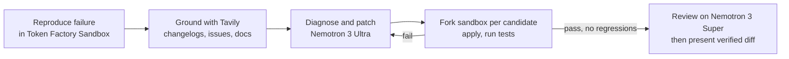

# ARCHON — Problem and Solution

> **Version:** 2.0.0 (revised after the September 11 audit)
> **Event:** Nebius x NVIDIA Global AI Hackathon, Track 1: Coding and Agentic Engineering
> **Bonus award targeted:** Best Use of Tavily
> **Stack:** Nebius Token Factory inference, Token Factory Sandboxes, NVIDIA Nemotron 3 Ultra / Super / Nano, Tavily Search API, FastAPI, Next.js 16

---

## 1. The problem

### 1.1 Broken builds are routine and the fix is mostly mechanical

A dependency ships a breaking release. A transitive package drifts. A runtime version changes. The test suite goes red and someone has to read the traceback, find the changelog, work out what moved, patch it, and re-run the tests. Most of that loop is not creative work. It is lookup and iteration.

### 1.2 Chat assistants do not close the loop

Pasting a stack trace into a chat model gets a plausible patch that nobody has executed. The model's training data usually predates the release that caused the break, so it suggests arguments and imports that no longer exist. The developer still applies the patch, runs the tests, and comes back with the next error. The assistant never sees the result of its own suggestion.

### 1.3 Letting an agent execute code is a safety problem

An agent that installs packages and runs tests has to run somewhere. On a developer laptop or a shared CI runner that is a real risk. Teams either refuse to let the agent execute anything, which makes it a chat assistant again, or they build and maintain their own container isolation.

### 1.4 Moving off a closed LLM provider is underserved

Teams that want to run open models on Nebius face a real migration: client construction, model-name mapping, tool and function-calling schema differences, Anthropic's Messages API shape versus chat completions, and embedding dimension changes that force a re-index. Their existing tests mock the LLM client, so a green suite after the change proves nothing about behavior.

---

## 2. The solution

ARCHON runs the whole loop, and runs it where it is safe.



1. **Reproduce.** Clone and install inside a Nebius Token Factory Sandbox, a VM-isolated environment hosted by Nebius. Run the tests. Record which tests fail and which pass. If nothing fails, stop.
2. **Ground.** Extract the error signature and the libraries involved. Call the Tavily Search API for the exact exception text, the library changelog, and related issue threads. The results go into the prompt as clearly marked untrusted context.
3. **Diagnose and patch.** Send the failing output, the relevant source excerpts, and the research brief to NVIDIA Nemotron 3 Ultra. It returns a root-cause note and up to two candidate patches as unified diffs.
4. **Verify on forks.** Each candidate is applied on its own fork of the baseline sandbox image and the tests run again. Candidates are scored: no previously passing test may break, then most failing tests fixed, then smallest patch. Losing forks are simply never referenced again. There is no rollback because nothing was mutated.
5. **Review and present.** Nemotron 3 Super checks the winning patch for deleted tests, unrelated changes, and credential-like strings. The user sees the diff, the test badge, the terminal transcript, the reasoning trace, and a download button.

If no candidate passes, the best attempt's output seeds the next iteration, up to five. If the mission hits its spend cap or iteration cap, the user gets a report of everything that was tried.

### The same loop runs migrations

A `MIGRATION` mission locates `openai` and `anthropic` client construction and model literals, asks Nemotron 3 Ultra for a patch that targets `https://api.tokenfactory.nebius.com/v1/` with Nemotron model names, runs the repository's tests in the sandbox, and additionally runs a small parity harness against recorded responses. The UI states plainly that mocked tests passing does not prove parity. A cost estimate is computed from a price table in the repository, with the table's date shown.

---

## 3. Why this fits the hackathon

**Track 1 says it directly.** The track description asks for agents that write, run, and test code in Token Factory Sandboxes. That is the core loop, not a feature bolted on.

**Sandboxes are used for what they are built for.** Fork-per-candidate and best-of-N selection is the pattern Nebius designed the branching model around. It is also what distinguishes ARCHON from repair agents that run one attempt in one container and roll back with git.

**Nemotron is used by tier, not by default.** Ultra is called once per iteration for the hard reasoning. Super runs the supervisor, the researcher, and the reviewer. Nano compacts logs. The routing is visible in the UI on every event.

**Tavily is inside the loop.** Grounding happens before the first patch attempt and the queries and result counts are shown in the reasoning stream. The Best Use of Tavily award requires a functional runtime call; this is one.

**The demo is a product, not a script.** Mission form, live reasoning, live terminal with one tab per fork, Monaco diff, patch download, and a replay mode so judges can watch a full run without spending anyone's credits.

---

## 4. Model routing

```python
ULTRA = "nvidia/nemotron-3-ultra-550b-a55b"
SUPER = "nvidia/nemotron-3-super-120b-a12b"
NANO  = "nvidia/nemotron-3-nano-30b-a3b"   # confirm exact ID with GET /v1/models

ROUTES = {
    "diagnose_and_patch": ULTRA,
    "supervise":          SUPER,
    "research":           SUPER,
    "review":             SUPER,
    "compact_logs":       NANO,
}
```

Development runs override `diagnose_and_patch` to Super to conserve credits. Golden-dataset runs and the video use Ultra.

---

## 5. Cost comparison for migration missions

The cost card in the UI computes from `pricing.json`, a table of current list prices with a last-updated date. Figures below are September 2026 list prices, blended at a 3:1 input-to-output token ratio. They are estimates and are presented as such.

| Model | Input / 1M | Output / 1M | Blended / 1M at 3:1 | Versus Nemotron 3 Ultra on Nebius |
| :--- | ---: | ---: | ---: | ---: |
| Nemotron 3 Ultra on Nebius Token Factory | $1.00 | $3.00 | $1.50 | baseline |
| Claude Sonnet 5 | $2.00 | $10.00 | $4.00 | 62% lower |
| GPT-5.4 | $2.50 | $15.00 | $5.63 | 73% lower |
| GPT-5.6 Sol | $5.00 | $30.00 | $11.25 | 87% lower |

Sources: [OpenAI pricing](https://developers.openai.com/api/docs/pricing), [Anthropic pricing](https://platform.claude.com/docs/en/about-claude/pricing), Nebius Ultra price as listed by [third-party catalogs](https://www.requesty.ai/models/nebius/nvidia-nemotron-3-ultra-550b-a55b). Verify the Nebius figure against the Token Factory pricing page before the submission and update `pricing.json`.

The cost claim is only part of the migration story. Data residency in the EU and open weights matter to some teams more than price. ARCHON reports the estimate and lets the user decide.

---

## 6. Cockpit

```
+------------------------------------------------------------------------------------------+
| ARCHON   BUG_HEALING   github.com/owner/repo@main    REASONING   iter 2/5   $0.41        |
+------------------------------------+-----------------------------------------------------+
| REASONING                          | TERMINAL        [a_03] [a_04]                       |
|                                    |                                                     |
| status  REPRODUCING                | $ cd /w && git apply --check /tmp/archon.patch      |
| tests   15 collected, 3 failed     | $ git apply /tmp/archon.patch                       |
| tavily  "pydantic 2 field_validator| $ pytest tests/ -q                                  |
|          replaces validator" 5 res | ...............                                     |
| thought super  Grounding done,     | 15 passed in 1.92s                                  |
|         requesting patches         |                                                     |
| thought ultra  validator() was     +-----------------------------------------------------+
|         removed in pydantic 2.0;   | DIFF   app/schemas/user.py        3 fail->pass  0 broken |
|         two candidates: ...        |                                                     |
| tests   a_03 1 fail->pass, 0 broken| - from pydantic import validator                    |
| tests   a_04 3 fail->pass, 0 broken| + from pydantic import field_validator              |
| review  super  APPROVE             | ...                                                 |
+------------------------------------+-----------------------------------------------------+
| ultra 61k in / 2.2k out  super 9k / 1.1k  nano 3k / 0.2k      [ Download patch ]  git apply |
+------------------------------------------------------------------------------------------+
```

---

## 7. Walkthroughs

### A. SWE-bench Verified instance

1. The user picks an instance from the dropdown. ARCHON spawns the preloaded sandbox and runs the fail-to-pass tests. The terminal shows the failures.
2. Two Tavily queries appear with result counts.
3. Nemotron 3 Ultra returns a root-cause note and two candidates. Two terminal tabs open and run in parallel.
4. One candidate fixes all fail-to-pass tests and breaks nothing. The reviewer approves. The diff panel shows the patch with the test badge.
5. The user downloads the patch.

### B. Migration of a small OpenAI-based service

1. The user submits a public repo URL and the test command.
2. ARCHON lists the client constructions and model literals it found.
3. Nemotron 3 Ultra returns the migration patch. The sandbox runs the repository tests.
4. The parity harness runs eight recorded prompts and reports a similarity score with the caveat about mocked tests.
5. The cost card shows the estimate, the price-table date, and the assumptions.

---

## 8. What ARCHON does not claim

- It does not guarantee correctness. It guarantees that the tests it shows you ran, in an isolated VM, on the patch you are looking at.
- It does not replace review. A human merges.
- It does not prove behavioral parity after a migration when the repository's tests mock the model. It says so in the UI and offers a small parity harness as a partial signal.
- It does not promise a fixed cost saving. It computes an estimate from current list prices and shows its assumptions.

---

## 9. Repository layout

```
1.platform/
├── client/                      # Next.js 16
│   └── src/
│       ├── app/                 # mission page, replay list
│       ├── components/          # ReasoningStream, Terminal, DiffViewer, SummaryBar
│       └── lib/                 # SSE client, Zustand store
└── server/                      # FastAPI
    ├── app/
    │   ├── main.py
    │   ├── settings.py
    │   ├── api/                 # missions, events (SSE), replays
    │   ├── core/                # state machine, router, scoring, pricing
    │   ├── roles/               # supervisor, researcher, engineer, reviewer, compactor
    │   ├── sandbox/             # contree-sdk service, pytest parser
    │   └── store/               # SQLite models
    ├── pricing.json
    └── tests/
        ├── unit/
        ├── integration/
        └── golden/
```

Details: [build/PRD.md](build/PRD.md), [build/DESIGN.md](build/DESIGN.md), [build/AGENTS.md](build/AGENTS.md), [build/TESTING.md](build/TESTING.md), [build/PLAN.md](build/PLAN.md).
