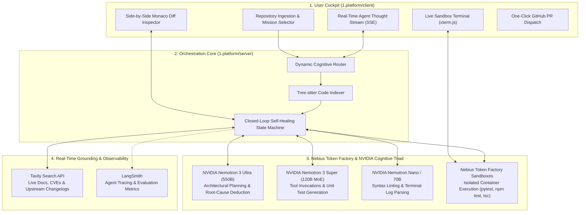

<div align="center">

# ARCHON: Autonomous Open-Infrastructure Software Engineering & Sovereign AI Migration Engine

[](https://opensource.org/licenses/Apache-2.0)
[](https://dev.nebius.com/)
[](https://www.nvidia.com/)
[](https://tavily.com/)
[](https://nebiusglobalaihackathon.devpost.com/)

<br />

### **Grand Prize Contender** for the **[Nebius x NVIDIA Global AI Hackathon](https://nebiusglobalaihackathon.devpost.com/)**  
*"Build the next frontier of AI on open infrastructure."*

<br />

<p align="center">
  <a href="https://dev.nebius.com/" target="_blank">
    
  </a>
  &nbsp;&nbsp;&nbsp;&nbsp;&nbsp;&nbsp;&nbsp;&nbsp;&nbsp;&nbsp;&nbsp;&nbsp;
  <a href="https://www.nvidia.com/" target="_blank">
    
  </a>
</p>

</div>

---

## 🚀 Overview & The 1st-Place Thesis

**`ARCHON`** is an autonomous, open-infrastructure software engineering and migration platform designed to solve the two biggest bottlenecks in modern AI development:
1. **The Sovereign Migration Imperative:** Autonomously refactoring codebases locked into proprietary APIs (OpenAI Assistants, Anthropic Claude, AWS Bedrock) to run natively on **Nebius Token Factory** and **NVIDIA Nemotron**, delivering **65%–80% cost reductions** with complete data sovereignty and zero vendor lock-in.
2. **Autonomous Closed-Loop Repository Self-Healing:** Diagnosing, reproducing, and repairing complex CI/CD failures, dependency breakages, and GitHub issues inside isolated **Nebius Token Factory Sandboxes**, verified by live regression test suites before code is ever merged.

All agent reasoning is grounded in real time using the **Tavily Search API** to pull upstream changelogs and documentation, eliminating hallucination.

### 🎯 Track Selection & Prize Target
* **Primary Track:** **Track 1: Coding and Agentic Engineering Track**
* **Secondary Cross-Eligibility:** **Track 2: Best Apps and Agents Track**
* **Target Awards:** **Grand Prize ($20,000 USD)** + **Best Use of Tavily ($3,000 USD)** + **City Winner Award ($500 USD)**

---

## 🏛️ System Architecture



---

## ⚡ The Three Core Operational Modes

1. **🔄 Sovereign AI Stack Migration (Closed to Open):**
   - Ingests repositories using `openai`, `anthropic`, or proprietary wrappers.
   - Refactors client initializations to the Nebius Token Factory API (`https://api.tokenfactory.nebius.com/v1`).
   - Maps model calls to **Nemotron 3 Ultra (550B)** and **Nemotron 3 Super (120B MoE)**.
   - Tests and verifies functional parity inside a Token Factory Sandbox.
2. **🛠️ Autonomous Bug & CI/CD Self-Healing:**
   - Ingests raw stack traces, failing GitHub Actions logs, or issue tickets.
   - Reproduces the failure inside a clean sandbox environment.
   - Uses Tavily to retrieve current upstream resolutions and documentation.
   - Nemotron 3 Ultra plans and authors multi-file surgical fixes.
   - Re-runs test suites iteratively until **100% green with zero regressions**.
3. **⚡ Upstream Dependency & Vulnerability Modernization:**
   - Identifies breaking changes across major library version bumps (e.g. Pydantic v1 -> v2, Next.js 14 -> 15).
   - Fetches official migration guides via Tavily.
   - Refactors deprecated code patterns with verified sandbox tests.

---

## 📂 Repository Structure

```
.
├── 0.docs/                         # Project research & hackathon documentation
│   ├── info.md                     # Comprehensive hackathon master dossier (rules, prizes, tracks)
│   └── problem+solution.md          # Complete ARCHON specification, architecture & benchmarks
├── 1.platform/                     # Working software platform
│   ├── client/                     # Next.js 15 developer cockpit (React 19, Tailwind, Monaco, xterm.js)
│   │   ├── package.json
│   │   └── src/
│   └── server/                     # FastAPI autonomous agent core (Python 3.11+, Nebius, Tavily)
│       ├── requirements.txt
│       └── app/
├── CONTRIBUTING.md                 # Git workflow, PR standards & team rules
├── LICENSE.md                      # Apache 2.0 Open Source License
├── README.md                       # Project overview & running guide (this file)
└── SECURITY.md                     # Agent safety, credential management & sandbox rules
```

---

## 🛠️ Quickstart & Setup Guide

### Prerequisites
- Node.js 18+ (for `1.platform/client`)
- Python 3.10+ (for `1.platform/server`)
- Nebius Token Factory API Key (`NEBIUS_API_KEY`)
- Tavily Search API Key (`TAVILY_API_KEY`)

### 1. Environment Configuration
Create a `.env` file in `1.platform/server/`:
```bash
# Nebius Token Factory Inference
NEBIUS_API_KEY=your_token_factory_key_here
NEBIUS_BASE_URL=https://api.tokenfactory.nebius.com/v1

# Tavily Real-Time Web Grounding
TAVILY_API_KEY=your_tavily_key_here

# (Optional) Observability & Tracing
LANGCHAIN_TRACING_V2=true
LANGCHAIN_API_KEY=your_langsmith_key_here
```

### 2. Backend Server Setup
```bash
cd 1.platform/server
python3 -m venv venv
source venv/bin/activate
pip install -r requirements.txt
python -m app.main
```
The server will start listening at `http://localhost:8000`.

### 3. Frontend Client Setup
```bash
cd 1.platform/client
npm install
npm run dev
```
Open [http://localhost:3000](http://localhost:3000) in your browser to launch the Archon Cockpit.

---

## 📋 Hackathon Submission Compliance Checklist

- [x] **Runs on Nebius Token Factory / AI Cloud:** Active runtime calls to `https://api.tokenfactory.nebius.com/v1`.
- [x] **Uses NVIDIA Open-Source Models:** Powered by NVIDIA Nemotron 3 Ultra (550B), Super (120B MoE), and Nano.
- [x] **Integrates Nebius Sandboxes:** Code compilation and regression testing performed in isolated containers.
- [x] **Integrates Tavily API:** Live web grounding in the autonomous reasoning loop for the $3,000 Bonus Award.
- [x] **Track Identification:** Submitted to **Track 1: Coding and Agentic Engineering Track**.
- [x] **Open Source License:** Fully compliant **Apache 2.0 License** in `LICENSE.md`.
- [x] **Working Demo & Video:** Live interactive web cockpit and 3-minute video walkthrough demonstrating autonomous migration and self-healing.

---

## 📄 License

This project is licensed under the **Apache License 2.0** — see the [LICENSE.md](file:///Users/eugenius/Work/Nebius-x-NVIDIA-Global-AI-Hackathon/LICENSE.md) file for details.
