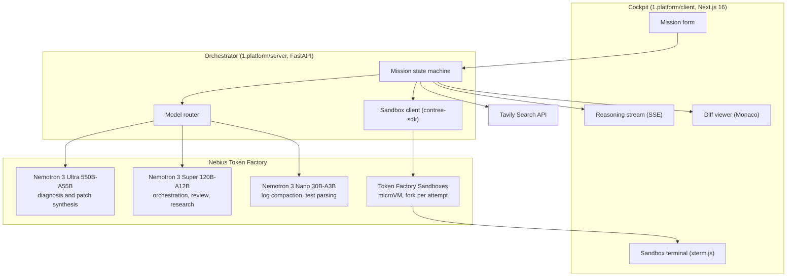

<div align="center">

# ARCHON

**Autonomous, sandbox-verified software repair and AI-stack migration, running on Nebius Token Factory and NVIDIA Nemotron.**

[](LICENSE.md)
[](https://tokenfactory.nebius.com/)
[](https://nebius.com/services/token-factory/nemotron)
[](https://docs.tokenfactory.nebius.com/sandboxes/overview)
[](https://tavily.com/)
[](https://nebiusglobalaihackathon.devpost.com/)

Submission to the **[Nebius x NVIDIA Global AI Hackathon](https://nebiusglobalaihackathon.devpost.com/)**, Track 1: Coding and Agentic Engineering.

</div>

---

## Status

> **Pre-alpha. Documentation and architecture only. No runnable code yet.**
> Development started September 11, 2026. Follow progress in [0.docs/build/SESSIONS.md](0.docs/build/SESSIONS.md) and the plan in [0.docs/build/PLAN.md](0.docs/build/PLAN.md).

---

## What ARCHON does

ARCHON takes a repository with a failing test suite, reproduces the failure inside a **Nebius Token Factory Sandbox**, researches the error with the **Tavily Search API**, asks **NVIDIA Nemotron 3 Ultra** to diagnose and patch it, and re-runs the tests inside the sandbox until they pass. Every candidate patch is tried on its own sandbox fork, so failed attempts are discarded rather than rolled back. The user gets a verified diff, the full terminal transcript, and the agent's reasoning trace.

Two mission types share that loop:

1. **Bug healing** (primary). Input: a repo plus a failing test command, or a SWE-bench Verified instance from the Sandboxes catalog. Output: a patch that makes the failing tests pass without breaking the passing ones.
2. **AI-stack migration** (secondary). Input: a repo that calls the OpenAI or Anthropic SDK. Output: a patch that points the client at Nebius Token Factory and maps model names to Nemotron equivalents, verified by the repo's own tests plus a small parity harness, with a cost estimate computed from a maintained price table.

Everything the agent does is streamed live to a web cockpit: reasoning, Tavily queries, sandbox terminal output, and a side-by-side diff.

## Architecture



## How Nebius and NVIDIA are used

| Component | What ARCHON uses it for |
| :--- | :--- |
| **Nebius Token Factory inference** (`https://api.tokenfactory.nebius.com/v1/`) | Every model call, through the OpenAI-compatible API. |
| **Nemotron 3 Ultra** (`nvidia/nemotron-3-ultra-550b-a55b`) | Root-cause analysis and patch generation. |
| **Nemotron 3 Super** (`nvidia/nemotron-3-super-120b-a12b`) | Mission supervisor, patch review, Tavily query synthesis. |
| **Nemotron 3 Nano** (`nvidia/nemotron-3-nano-30b-a3b`) | Compacting test logs and parsing pass/fail counts. Confirm the exact ID with `GET /v1/models` before use. |
| **Token Factory Sandboxes** (`contree-sdk`) | Clone, install, run tests, and fork one sandbox per candidate patch. Currently in beta. |
| **Tavily Search API** | Fetches current documentation and upstream issue threads for the failing library before the model reasons about a fix. |

## Repository layout

```
.
├── 0.docs/
│   ├── info.md                 # Hackathon rules, prizes, dates, platform notes
│   ├── problem+solution.md     # Problem framing and solution overview
│   ├── prior-art.md            # Competitive landscape
│   └── build/
│       ├── PRD.md              # Requirements
│       ├── DESIGN.md           # Technical design
│       ├── AGENTS.md           # Agent roles, prompts, protocols
│       ├── PLAN.md             # Schedule, budget, risks
│       ├── TESTING.md          # Test strategy and golden dataset
│       └── SESSIONS.md         # Session log and ADRs
├── 1.platform/
│   ├── client/                 # Next.js 16 cockpit (not yet scaffolded)
│   └── server/                 # FastAPI orchestrator (not yet scaffolded)
├── 2.submission/
│   ├── README.md               # Devpost submission text (draft)
│   └── FEEDBACK.md             # Running log of Nebius / NVIDIA developer feedback
├── CONTRIBUTING.md
├── LICENSE.md                  # Apache 2.0
├── README.md
└── SECURITY.md
```

## Quickstart

The commands below describe the intended setup. They will work once `1.platform/` is scaffolded.

### Prerequisites

- Python 3.12+
- Node.js 20+
- A Nebius Token Factory API key with Sandboxes beta access
- A Tavily API key

### Server

```bash
cd 1.platform/server
cp .env.example .env        # then fill in NEBIUS_API_KEY and TAVILY_API_KEY
python -m venv .venv && source .venv/bin/activate
pip install -r requirements.txt
uvicorn app.main:app --reload --port 8000
```

### Client

```bash
cd 1.platform/client
npm install
npm run dev
```

Open `http://localhost:3000`.

### Environment variables

```bash
NEBIUS_API_KEY=            # Token Factory inference and Sandboxes
NEBIUS_BASE_URL=https://api.tokenfactory.nebius.com/v1/
NEBIUS_SANDBOX_URL=https://api.tokenfactory.nebius.com/sandboxes
TAVILY_API_KEY=
ARCHON_DEMO_TOKEN=         # Required for live mode on the public demo
ARCHON_MAX_MISSION_USD=3   # Hard per-mission spend cap
```

## Submission checklist

Boxes are ticked only when the item exists and has been verified.

- [ ] Runs on Nebius Token Factory: live inference calls to `api.tokenfactory.nebius.com`
- [ ] Uses NVIDIA open models: Nemotron 3 Ultra, Super, and Nano
- [ ] Executes code in Token Factory Sandboxes
- [ ] Tavily Search API called at runtime inside the reasoning loop
- [ ] Track chosen: Track 1, Coding and Agentic Engineering
- [x] Open-source license: Apache 2.0 in `LICENSE.md`
- [ ] Public demo URL, live through the judging window (Dec 1 to Dec 15, 2026)
- [ ] YouTube demo video under three minutes
- [ ] Product feedback section written ([2.submission/FEEDBACK.md](2.submission/FEEDBACK.md))
- [ ] Devpost entry submitted before Oct 30, 2026, 10:00 AM PDT

## License

Apache License 2.0. See [LICENSE.md](LICENSE.md).
